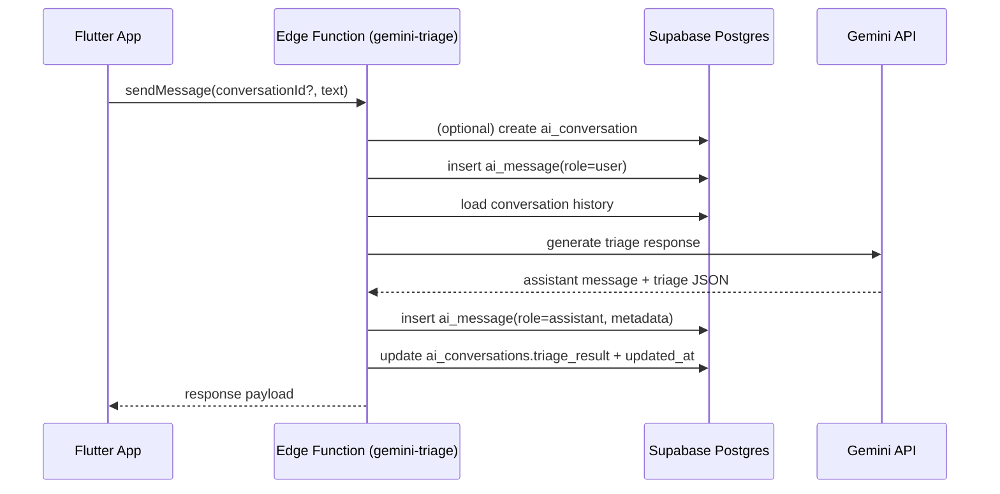
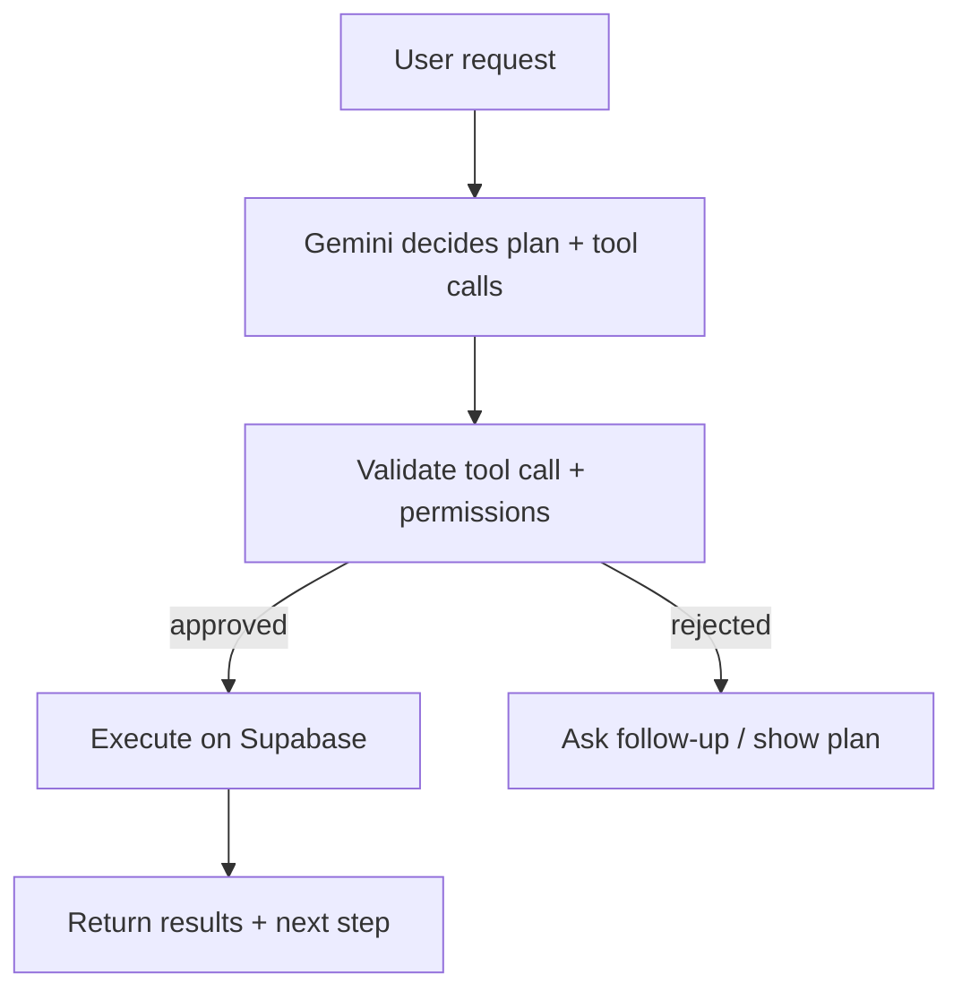

# VoxMed — AI Integration Workflow (Chat → Voice → Agentic)

This document is the implementation workflow for building the VoxMed AI assistant in three parts:

1) **Chat (text only)** — symptom triage + doctor guidance
2) **Voice** — speech-to-text + text-to-speech in the assistant screen
3) **Agentic workflows** — safe, tool-driven actions (booking, tests, scheduling) with explicit user approval

It is written to match the current VoxMed repo architecture: **Flutter + Supabase + Supabase Edge Functions + Google Gemini**.

---

## 0) Current state (repo audit)

Already present in the codebase:

- **AI Assistant UI**: `lib/screens/ai_assistant_screen.dart`
  - Chat UI with session actions (new chat, resume old chat, delete chat), follow-up chips UI (reads `metadata.follow_ups`), and loading state while AI responds.
  - Foreground voice scaffolding using `speech_to_text` + `flutter_tts`.
  - Sends messages through `AiRepository.sendMessage()` which invokes `gemini-triage`.

- **AI repository/providers**:
  - `lib/repositories/ai_repository.dart` (send message, list sessions/messages, delete session)
  - `lib/providers/prescription_provider.dart` (`aiRepositoryProvider`, `aiConversationsProvider`, `aiMessagesProvider`)

- **Part 1 Edge Function source**:
  - `supabase/functions/gemini-triage/index.ts`
  - `supabase/functions/gemini-triage/system_prompts.json`
  - Includes API-key fallback logic for free-tier rate limits (`GEMINI_API_KEY_1..N`).

- **Schema compatibility check**: `docs/database_schema.md`
  - `ai_conversations` supports multi-session history via `id`, `title`, `created_at`, `updated_at`.
  - `ai_messages` supports message history via `conversation_id`, `role`, `content`, `metadata`, `created_at`.
  - `ai_messages.conversation_id` uses `ON DELETE CASCADE` in the SQL migration section, so deleting a chat session removes child messages.
  - RLS policies allow users to manage only their own conversations/messages.

- **Legacy read provider location**: `lib/providers/prescription_provider.dart`
  - `aiConversationsProvider` reads `ai_conversations`.
  - `aiMessagesProvider(conversationId)` reads `ai_messages`.

- **Gemini Edge Function invocation pattern**: `lib/repositories/medical_record_repository.dart`
  - Calls `supabase.functions.invoke('gemini-ocr', body: {...})`.
  - This is the pattern to reuse for `gemini-triage`.

- **Docs worth reading alongside this workflow**:
  - `docs/ai_integration_feasibility.md` (platform constraints + permissions, esp. background voice/notifications)
  - `docs/database_schema.md` (tables: `ai_conversations`, `ai_messages`, `adherence_logs` voice transcript fields)
  - `docs/development_plan.md` (planned function: `gemini-triage`)

---

## 1) Guiding principles (do this first)

### 1.1 Keep secrets off the client

The Flutter app currently loads `.env` as an **asset** (see `pubspec.yaml` and `main.dart`). Anything in that file is packaged into the app.

- ✅ Safe to keep in the Flutter `.env` asset:
  - `SUPABASE_URL`
  - `SUPABASE_PUBLISHABLE_KEY` (anon key)
- ❌ Do **not** keep in the Flutter `.env` asset:
  - `SUPABASE_SERVICE_ROLE_KEY`
  - any `GEMINI_API_KEY_*`

Current repo note:

- `.env` currently contains Gemini keys. Since `.env` is bundled as a Flutter asset in this project, move those keys to Supabase Edge Function secrets and remove them from client `.env` before production release.

**Recommended:** store Gemini keys and model settings in **Supabase Edge Function secrets**, not in Flutter.

### 1.2 “Assistant” must be safe-by-default

- Always display/retain a medical disclaimer (“not a doctor”, “emergency guidance”).
- Don’t auto-book, auto-notify doctors, or auto-schedule meds without explicit user confirmation.
- Log AI decisions + tool executions (agentic phase) for auditability.

---

## 2) Part 1 — Chat-only (text) ready

### 2.1 “Done” definition

Chat-only is considered ready when:

- The patient can type symptoms and receive a **Gemini-generated assistant reply**.
- Replies are stored in `ai_messages` with `role='assistant'`.
- The conversation row (`ai_conversations`) is updated with a `triage_result` JSON (at minimum: `{ severity, specialty, suggested_doctors[] }`).

### 2.2 Architecture (recommended)

Use a Supabase Edge Function as the secure middleman:



### 2.3 Backend steps (Edge Function: `gemini-triage`)

**A) Create/track Edge Function source in-repo (recommended)**

Add an Edge Functions folder (even if you deploy separately later), so the behavior is versioned.

Suggested layout:

- `supabase/functions/gemini-triage/index.ts`
- `supabase/functions/_shared/...` (shared helpers, prompt templates)

**B) Secrets / configuration**

Set these values as Supabase secrets (examples; names can vary):

- `GEMINI_API_KEY_1` (primary)
- `GEMINI_API_KEY_2...GEMINI_API_KEY_N` (fallback keys)
- optional `GEMINI_API_KEY` (single-key fallback)
- `GEMINI_MODEL` (example: `gemini-3-flash-preview`)

Fallback behavior:

- The function attempts keys in order.
- If a key is rate-limited (`429`, `RESOURCE_EXHAUSTED`, quota/rate-limit errors), it automatically retries with the next key.
- If all keys fail, the function returns an error to the app.

**C) Input contract (request body)**

Minimum payload:

- `conversationId` (optional)
- `message` (required)

Optional (later):

- `locale`, `timezone`
- `patientContext` (age range, sex, known conditions) — only if user provides it

**D) Output contract (response body)**

Return a single JSON object that the client can store/display:

```json
{
  "conversationId": "uuid",
  "assistantMessage": "...",
  "followUps": ["..."],
  "triageResult": {
    "severity": "low|medium|high|emergency",
    "specialty": "...",
    "suggested_doctors": ["doctor_uuid", "doctor_uuid"],
    "red_flags": ["..."],
    "disclaimer": "..."
  }
}
```

Actual function envelope used by the Flutter app:

```json
{
  "success": true,
  "data": {
    "conversationId": "uuid",
    "assistantMessage": "...",
    "followUps": ["..."],
    "triageResult": {
      "severity": "low|medium|high|emergency",
      "specialty": "...",
      "suggested_doctors": ["doctor_uuid"],
      "red_flags": ["..."],
      "disclaimer": "..."
    }
  }
}
```

**E) Persist results**

- Insert assistant message into `ai_messages` with:
  - `role='assistant'`
  - `content = assistantMessage`
  - `metadata = { follow_ups: [...], triage_result_preview: {...} }` (optional)
- Update `ai_conversations.triage_result` with the final `triageResult`.

**F) Doctor suggestion (minimal, useful)**

If you want “suggested doctors” immediately:

- Have the Edge Function query `doctors` filtered by `specialty` and maybe rating.
- Store only doctor IDs in `triage_result.suggested_doctors`.
- Flutter can later fetch full doctor cards via existing doctor queries.

### 2.4 Flutter steps (wire chat to the backend)

Implemented:

1) AI data layer:
  - `lib/repositories/ai_repository.dart`
  - `sendMessage(...)`, `listConversations(...)`, `listMessages(...)`, `deleteConversation(...)`
2) Screen wiring:
  - `AiAssistantScreen._sendMessage` now calls `AiRepository.sendMessage(...)`
  - invalidates `aiConversationsProvider` and `aiMessagesProvider(...)` after response
  - shows a “Thinking...” bubble during in-flight requests
3) Session management UI:
  - New chat action
  - History bottom sheet to resume old sessions
  - Delete chat session action

Remaining for production:

- Cloud deploy + secrets setup completed on 2026-04-14 (project `jedgnisrjwemhazherro`; function `gemini-triage` active).
- Add UI deep-link from triage doctor suggestions to Find Care/Booking.

### 2.5 Editable system prompt file

Use this file for prompt iteration:

- `supabase/functions/gemini-triage/system_prompts.json`

Structure:

```json
{
  "patient": "...",
  "doctor": "..."
}
```

Best-practice notes applied:

- safety-first behavior
- emergency escalation language
- no medication dosage instructions
- role-specific behavior for patient vs doctor assistants

### 2.6 Deployment checklist (Part 1)

Current status: baseline deployment is complete and reachable in cloud (unauthenticated calls return 401 instead of 404).

1) Set Supabase function secrets:

```bash
supabase secrets set GEMINI_API_KEY_1=... GEMINI_API_KEY_2=... GEMINI_API_KEY_3=...
supabase secrets set GEMINI_MODEL=gemini-3-flash-preview
```

2) Deploy function:

```bash
supabase functions deploy gemini-triage
```

3) Confirm auth + invocation:

- call from app while logged in
- verify rows in `ai_conversations` + `ai_messages`
- verify `triage_result` updates
- simulate rate-limit by disabling first key and confirm fallback key usage

### 2.7 Testing checklist (chat-only)

Manual:

- Send a message with no conversation → conversation is created and both messages appear.
- Send another message → stays in same conversation.
- Network error → UI shows an error, does not crash.

Automated (later):

- Edge Function unit tests for:
  - JWT validation
  - schema validation
  - prompt → response JSON parsing
- Flutter widget tests for:
  - loading indicator
  - rendering follow-up chips from `metadata.follow_ups`

---

## 3) Part 2 — Voice features (STT + TTS)

### 3.1 “Done” definition

Voice features are considered ready when:

- In the AI assistant screen, the user can:
  - tap mic → speak → speech-to-text fills the input
  - message is sent automatically on final transcript (or via explicit send)
- Assistant replies can be spoken aloud (TTS) in-app.

### 3.2 Current status

Voice scaffolding already exists in `lib/screens/ai_assistant_screen.dart`:

- `SpeechToText` initialization and listening
- `FlutterTts` configuration + speaking
- speaking the most recent assistant message once (tracked by `_lastSpokenAssistantMessageId`)

### 3.3 Hardening steps

- **Permissions**
  - Android: confirm `android.permission.RECORD_AUDIO` is present.
  - iOS: add `NSMicrophoneUsageDescription` in `ios/Runner/Info.plist` (required for App Store / runtime permission).

- **Avoid “TTS gets transcribed by STT” loops**
  - When starting STT listening, call `_tts.stop()`.
  - While listening, do not auto-speak assistant messages.

- **UX controls**
  - Ensure the voice/chat toggle is clear.
  - Add a clear “Stop” behavior.

### 3.4 Testing checklist (voice)

- First launch: mic permission prompt appears; denial shows a clear message.
- Background → foreground: STT still works, no crashes.
- Long answers: TTS speaks reliably and can be stopped.

> Note: background “talking notifications” are not reliable cross-platform; see `docs/ai_integration_feasibility.md`.

---

## 4) Part 3 — Agentic workflows (safe automation)

### 4.1 “Done” definition

Agentic workflows are considered ready when:

- The assistant can propose an action plan (structured), and
- after explicit user approval, it can execute **approved** actions via safe server-side tools.

Examples:

- “Book appointment with Dr. X next Tuesday at 10am”
- “Create a medication schedule reminder” (writes future `adherence_logs` rows)
- “Recommend tests and add them to a to-do list” (requires a new table or an agreed storage pattern)

### 4.2 Recommended approach: tool-driven Edge Function

Implement a dedicated Edge Function (or functions) that:

- calls Gemini with **tool definitions**
- validates tool calls
- executes tool calls against Supabase (service role)
- logs every action to an audit trail

High-level loop:



### 4.3 Start with a minimal toolset (safe + valuable)

Suggested first tools:

1) `suggest_specialty(symptoms)` → returns specialty + severity
2) `list_doctors_by_specialty(specialty)` → returns doctor IDs
3) `create_appointment_request(doctorId, preferredTimes)` → creates a *draft* (or a “pending confirmation” record)
4) `create_med_schedule(prescriptionItemId, times, startDate, days)` → inserts future `adherence_logs` rows (status `pending`)

### 4.4 Database considerations

You can implement agentic actions without new tables at first by using existing ones:

- appointments → booking actions
- adherence_logs → medication schedule + tracking
- notifications → confirmations and reminders

For “tests to do” / “care plan items”, you’ll likely want a small new table (example idea):

- `care_tasks(id, patient_id, title, type, due_date, status, metadata, created_at)`

### 4.5 Safety and approval model

Hard rule: **no silent writes**.

- The assistant returns a **proposed plan** first.
- The UI shows “Approve / Edit / Cancel”.
- Only after approval does the Edge Function execute.

### 4.6 Testing checklist (agentic)

- Tool call validation rejects unsafe arguments.
- RLS/service-role usage is correct: user can only affect their own data.
- Every action is logged (who, what, when, result).

---

## 5) Open questions to refine before implementation

Answering these will make Part 1–3 much faster to implement:

1) For **chat-only**, do you want the assistant to:
   - ask follow-up questions first, OR
   - produce a triage JSON immediately on every message?

2) Should AI triage be **patient-only**, or should doctors use it too?

3) For **agentic actions**, which writes are allowed initially?
   - booking appointment drafts
   - medication schedule creation
   - notifications
   - anything else?

4) What locales/regions should we support (affects medical disclaimers + emergency guidance wording)?
