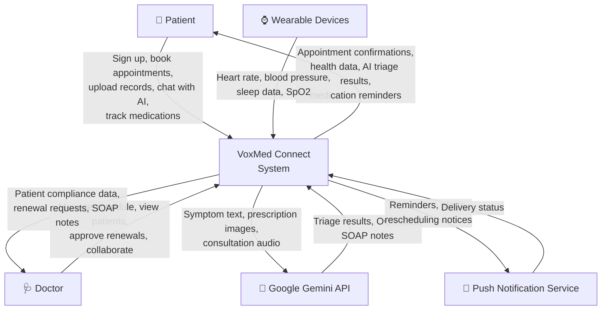
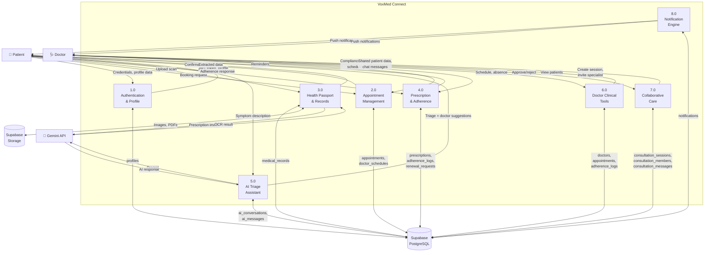
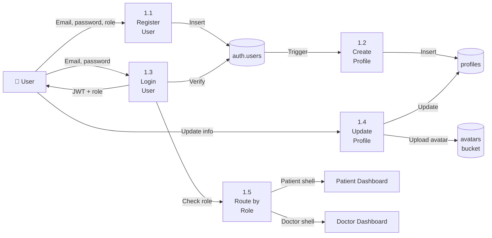
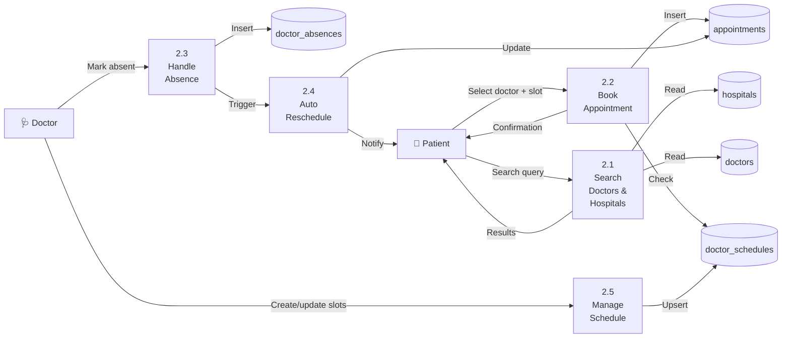
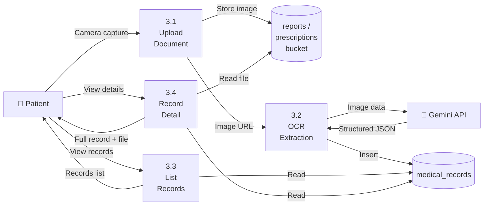
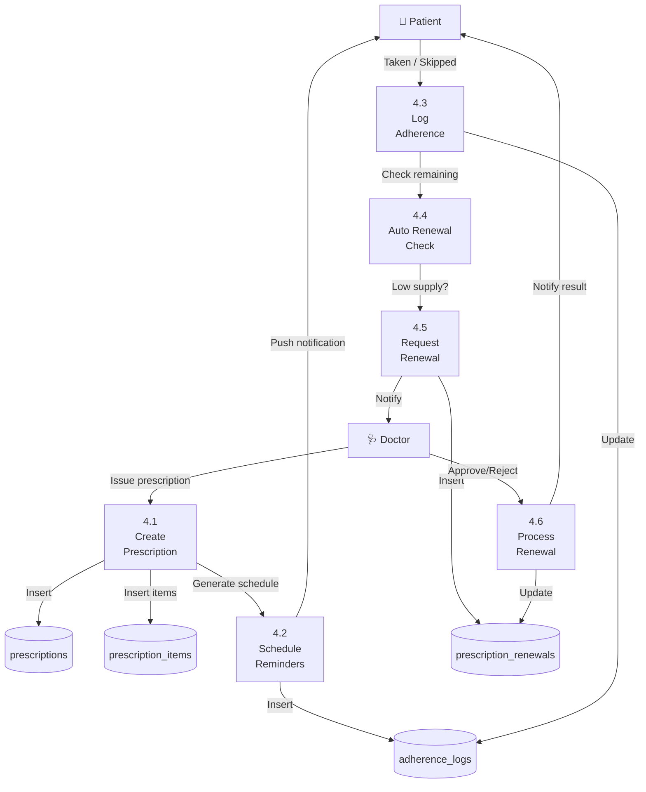
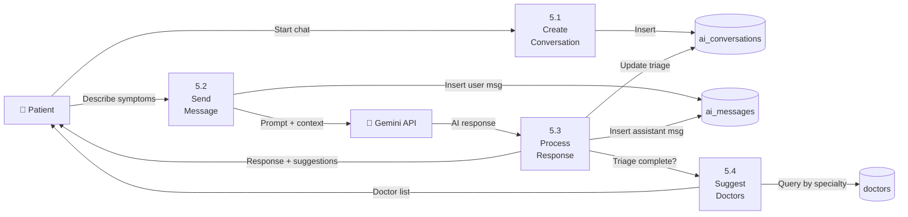
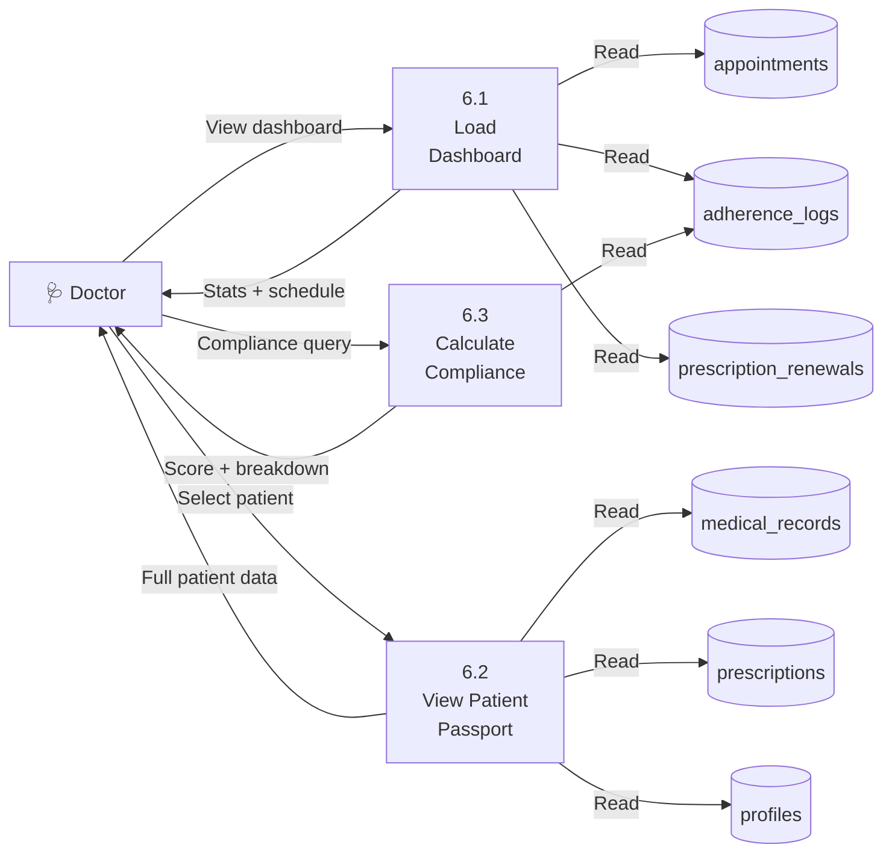
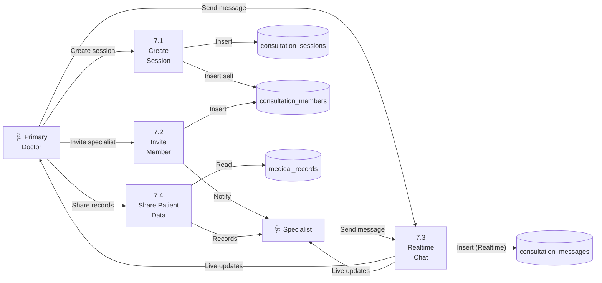

# VoxMed Connect — Data Flow Diagrams

> **Last Updated:** 2026-03-28

---

## Table of Contents

1. [Context Diagram (Level -1)](#1-context-diagram)
2. [Level-0 DFD](#2-level-0-dfd)
3. [Level-1 DFDs](#3-level-1-dfds)

---

## 1. Context Diagram

The highest-level view showing VoxMed Connect as a single system interacting with external entities.

### External Entities

| Entity                    | Description                                                   |
|---------------------------|---------------------------------------------------------------|
| **Patient**               | End user who manages health records, books appointments, and interacts with AI |
| **Doctor**                | Clinician who manages schedules, views patient data, approves prescriptions |
| **Google Gemini API**     | AI service for OCR extraction, symptom triage, and SOAP note generation |
| **Wearable Devices**     | Smartwatches/rings that provide biometric data (Phase 2+)     |
| **Push Notification Service** | FCM/APNs for delivering reminders and alerts               |

---

## 2. Level-0 DFD

Decomposes the VoxMed system into its major processing subsystems.

### Process Descriptions

| Process | Name                          | Description                                                |
|---------|-------------------------------|------------------------------------------------------------|
| 1.0     | Authentication & Profile      | User registration, login, role assignment, profile management |
| 2.0     | Appointment Management        | Search doctors/hospitals, book/cancel/reschedule appointments |
| 3.0     | Health Passport & Records     | Upload, store, and OCR-process medical documents            |
| 4.0     | Prescription & Adherence      | Manage prescriptions, track medication compliance, handle renewals |
| 5.0     | AI Triage Assistant           | Conversational symptom analysis and doctor recommendation   |
| 6.0     | Doctor Clinical Tools         | Doctor dashboard, schedule management, patient compliance views |
| 7.0     | Collaborative Care            | Multi-doctor consultation sessions with realtime messaging  |
| 8.0     | Notification Engine           | Medication reminders, appointment alerts, system notifications |

### Data Stores

| Store            | Description                                                   |
|------------------|---------------------------------------------------------------|
| Supabase PostgreSQL | All relational data (19 tables as defined in database_schema.md) |
| Supabase Storage | Binary files (avatars, report images, prescription scans)     |

---

## 3. Level-1 DFDs

### 3.1 Process 1.0 — Authentication & Profile

---

### 3.2 Process 2.0 — Appointment Management

---

### 3.3 Process 3.0 — Health Passport & Records

---

### 3.4 Process 4.0 — Prescription & Adherence

---

### 3.5 Process 5.0 — AI Triage Assistant

---

### 3.6 Process 6.0 — Doctor Clinical Tools

---

### 3.7 Process 7.0 — Collaborative Care

---

## Summary

| Diagram       | Purpose                                        | Key Insight                                          |
|---------------|-------------------------------------------------|------------------------------------------------------|
| Context       | System boundary and external actors              | 5 external entities interact with VoxMed             |
| Level-0       | Major subsystems and data stores                 | 8 core processes, 2 data stores (DB + Storage)       |
| Level-1 (×7)  | Internal data flow within each subsystem         | Shows exact tables touched and data transformations  |

> **Reference:** See [database_schema.md](./database_schema.md) for full table definitions and [development_plan.md](./development_plan.md) for implementation phasing.
