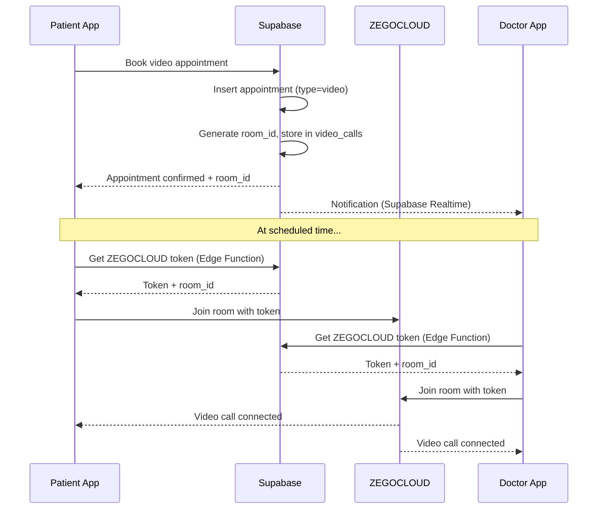
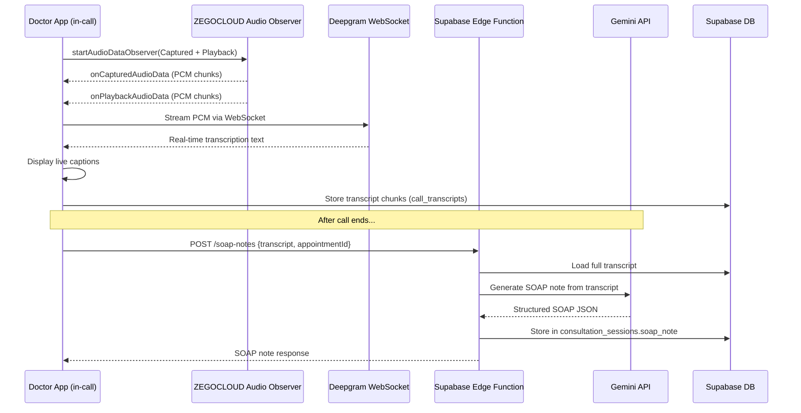
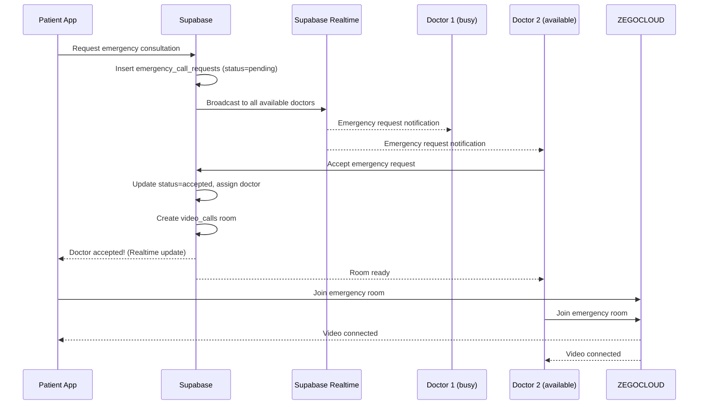

# VoxMed — Video Calling Implementation Plan

> **Author:** AI Assistant  
> **Created:** 2026-04-15  
> **Status:** Pre-Development Research & Architecture  
> **Stack:** Flutter + Supabase + ZEGOCLOUD + Deepgram + Gemini

---

## Table of Contents

1. [Executive Summary](#1-executive-summary)
2. [Current Project State](#2-current-project-state)
3. [Platform Comparison & Selection](#3-platform-comparison--selection)
4. [Architecture Overview](#4-architecture-overview)
5. [ZEGOCLOUD Setup Guide](#5-zegocloud-setup-guide)
6. [Database Schema Changes](#6-database-schema-changes)
7. [Phase 1 — Basic Video Calling](#7-phase-1--basic-video-calling)
8. [Phase 2 — Scheduled Meetings & Notifications](#8-phase-2--scheduled-meetings--notifications)
9. [Phase 3 — Emergency Calling (Early Responder)](#9-phase-3--emergency-calling-early-responder)
10. [Phase 4 — Advanced: Real-Time ASR Transcription](#10-phase-4--advanced-real-time-asr-transcription)
11. [Phase 5 — Advanced: SOAP Notes Generation](#11-phase-5--advanced-soap-notes-generation)
12. [Flutter Dependencies](#12-flutter-dependencies)
13. [Secret & Key Management](#13-secret--key-management)
14. [File Structure](#14-file-structure)
15. [Coding Examples](#15-coding-examples)
16. [Testing Plan](#16-testing-plan)
17. [Cost Analysis](#17-cost-analysis)
18. [References & Resources](#18-references--resources)
19. [Open Questions](#19-open-questions)

---

## 1. Executive Summary

VoxMed needs video calling for three core flows:

| Flow | Description | Priority |
|------|-------------|----------|
| **Scheduled Online Consultation** | Patient books a "video" appointment → system creates a room → both get notified → join at scheduled time | P0 |
| **Emergency Consultation** | Patient requests an emergency call → any available doctor (early responder) accepts → video starts immediately | P0 |
| **In-Call AI Transcription + SOAP** | During the video call, audio is captured via ASR → transcription is stored → Gemini generates SOAP notes → displayed in doctor's dashboard | P1 |

### Technology Choices (Why)

| Component | Chosen | Why |
|-----------|--------|-----|
| **Video/Audio Engine** | **ZEGOCLOUD** (`zego_uikit_prebuilt_call`) | 10K free minutes, excellent Flutter UIKit, built-in call invitation, push notification support, raw audio data API for ASR |
| **Real-Time ASR** | **Deepgram** (streaming WebSocket) | $200 free credit, best-in-class latency (<300ms), medical vocabulary support, Dart package available (`deepgram_speech_to_text`) |
| **SOAP Notes Generation** | **Google Gemini** (existing in project) | Already integrated via `gemini-triage` Edge Function pattern; reuse secrets and fallback key logic |
| **Meeting Scheduling & Notification** | **Supabase** (Realtime + Edge Functions + Notifications table) | Already the project backend; observer pattern via Supabase Realtime subscriptions |

---

## 2. Current Project State

### What's Already Built

- ✅ **Appointment system** with `appointment_type` enum including `video` — already supports video appointment booking
- ✅ **`LiveConsultationScreen`** — exists as a static UI stub (vitals dashboard, patient complaint, AI differentials)
- ✅ **Supabase Realtime** — used in collaborative care; pattern can be reused for call notifications
- ✅ **Notification model & table** — `notifications` table with `notification_type` enum
- ✅ **Gemini Edge Function pattern** — `gemini-triage` with key fallback; reusable for `soap-notes` function
- ✅ **AI Repository** — `lib/repositories/ai_repository.dart` with Edge Function invocation pattern
- ✅ **Speech-to-text scaffolding** — `speech_to_text` package already in `pubspec.yaml`
- ✅ **`consultation_sessions`** table with `soap_note` JSONB column — ready for SOAP data

### What Needs to Be Built

- 🔴 ZEGOCLOUD SDK integration
- 🔴 Video call room management (create/join/leave)
- 🔴 Call invitation system (scheduled + emergency)
- 🔴 In-call audio streaming to ASR
- 🔴 Transcription storage and display
- 🔴 SOAP notes Edge Function (`soap-notes`)
- 🔴 Doctor dashboard integration for transcripts + SOAP

---

## 3. Platform Comparison & Selection

### Video Call Platforms Evaluated

| Feature | ZEGOCLOUD | Agora | 100ms | Stream |
|---------|-----------|-------|-------|--------|
| **Free Tier** | 10,000 min | 10,000 min | 10,000 min | Limited trial |
| **Flutter UIKit** | ✅ Excellent (`zego_uikit_prebuilt_call`) | ✅ Good | ✅ Good (`hmssdk_flutter`) | ✅ Good |
| **Call Invitation (built-in)** | ✅ Yes (online + offline push) | ❌ Manual | ❌ Manual | ✅ Yes |
| **Raw Audio Access** | ✅ `startAudioDataObserver` PCM callbacks | ✅ Yes | ✅ Yes | ❌ Limited |
| **Push Notification (offline calls)** | ✅ Built-in ZPNs (FCM/APNs) | ❌ DIY | ❌ DIY | ✅ Yes |
| **Flutter Package Quality** | ⭐⭐⭐⭐ (140 pub points, 4.47k downloads) | ⭐⭐⭐⭐ | ⭐⭐⭐ | ⭐⭐⭐ |
| **1-on-1 Video Call Config** | One-liner: `ZegoUIKitPrebuiltCallConfig.oneOnOneVideoCall()` | More setup | More setup | More setup |
| **Server-side Token Gen** | ✅ `@zegocloud/zego_server_assistant` for Deno | ✅ | ✅ | ✅ |
| **Cost Beyond Free** | $3.99/1000 min | $3.99/1000 min | Similar | Higher |

### 🏆 Decision: **ZEGOCLOUD**

**Why ZEGOCLOUD wins for VoxMed:**

1. **Built-in call invitation** — saves ~2 weeks of development vs manual FCM/APNs integration
2. **Prebuilt UIKit** — production-ready video call UI with controls, device management, PIP mode
3. **Raw audio data API** — `startAudioDataObserver` gives us PCM audio frames for ASR pipeline
4. **Supabase Edge Function compatibility** — `@zegocloud/zego_server_assistant` works in Deno runtime
5. **10K free minutes** — enough for development + testing + initial deployment

### ASR Platforms Evaluated

| Feature | Deepgram | Google Cloud STT | Whisper API (OpenAI) | `speech_to_text` (on-device) |
|---------|----------|-------------------|----------------------|------------------------------|
| **Free Tier** | $200 credit | $300 GCP credit | Pay-per-use | Free (on-device) |
| **Real-time Streaming** | ✅ WebSocket (sub-300ms latency) | ✅ gRPC streaming | ❌ Batch only | ✅ On-device |
| **Medical Vocabulary** | ✅ Customizable models | ✅ Medical model available | Good general | Depends on OS |
| **Dart/Flutter Package** | ✅ `deepgram_speech_to_text` | ❌ gRPC (manual) | ❌ REST only | ✅ Built-in |
| **Can Process External PCM** | ✅ Via WebSocket raw bytes | ✅ Via gRPC | ❌ File upload | ❌ Mic only |
| **Speaker Diarization** | ✅ Yes | ✅ Yes | ❌ No | ❌ No |

### 🏆 Decision: **Deepgram** for Advanced ASR

**Why Deepgram:**
1. **WebSocket streaming** — perfect for real-time transcription during calls
2. **Dart package** — `deepgram_speech_to_text` supports all STT features
3. **Speaker diarization** — can distinguish doctor vs patient in transcript
4. **Medical-grade accuracy** — custom vocabulary and model fine-tuning
5. **$200 free credit** — generous for development

**Fallback:** For Phase 1 basic transcription, we can use the existing `speech_to_text` package (already in pubspec) to capture the local user's mic. Deepgram upgrades this for full call audio (both parties).

---

## 4. Architecture Overview

### Basic Video Call Flow



### Advanced: ASR + SOAP Notes Flow



### Emergency Call Flow



---

## 5. ZEGOCLOUD Setup Guide

### 5.1 Create ZEGOCLOUD Account & Project

1. Go to [ZEGOCLOUD Console](https://console.zegocloud.com/)
2. Sign up (no credit card required for free tier)
3. Click **"Create your project"**
4. Select use case: **"Video Call"**
5. Note down:
   - **App ID** (numeric, e.g., `1234567890`)
   - **App Sign** (hex string)
   - **Server Secret** (for server-side token generation)

### 5.2 Enable Required Services

In the ZEGOCLOUD Console, enable:

1. **In-app Chat (ZIM)** — required for call invitations
2. **Push Notification (ZPNs)** — required for offline call invitations
   - Upload **FCM Server Key** (from Firebase Console)
   - Upload **APNs Certificate** (from Apple Developer)
   - Create a **Resource ID** (links your app to push config)

### 5.3 Firebase Setup (for Android Push)

1. Go to [Firebase Console](https://console.firebase.google.com/)
2. Create or use existing project
3. Add Android app with your package name (`com.voxmed.connect`)
4. Download `google-services.json` → place in `android/app/`
5. Get **Server Key** from: Firebase Console → Project Settings → Cloud Messaging → Server Key
6. Upload to ZEGOCLOUD Console → Project → Push Notification → Android → FCM

### 5.4 Where to Put Keys in the VoxMed Project

| Key | Where | How |
|-----|-------|-----|
| `ZEGO_APP_ID` | Flutter `.env` file | Safe — it's a public app identifier |
| `ZEGO_APP_SIGN` | Flutter `.env` file | Safe for UIKit — used for quick start auth |
| `ZEGO_SERVER_SECRET` | **Supabase Edge Function secrets** | ⚠️ NEVER in client code — used for token generation |
| `DEEPGRAM_API_KEY` | **Supabase Edge Function secrets** | ⚠️ Server-side only |
| Firebase `google-services.json` | `android/app/google-services.json` | Required for FCM |
| ZPNs Resource ID | Flutter code (init config) | Public identifier |

```bash
# Add to Flutter .env file
ZEGO_APP_ID=1234567890
ZEGO_APP_SIGN=your_app_sign_hex_string

# Add to Supabase secrets (CLI)
npx supabase secrets set ZEGO_APP_ID=1234567890
npx supabase secrets set ZEGO_SERVER_SECRET=your_server_secret
npx supabase secrets set DEEPGRAM_API_KEY=your_deepgram_api_key
```

---

## 6. Database Schema Changes

### 6.1 New Table: `video_calls`

Tracks active/completed video call rooms tied to appointments.

```sql
CREATE TABLE video_calls (
  id             uuid        PRIMARY KEY DEFAULT gen_random_uuid(),
  appointment_id uuid        NOT NULL REFERENCES appointments(id) ON DELETE CASCADE,
  room_id        text        NOT NULL UNIQUE,        -- ZEGOCLOUD room identifier
  patient_id     uuid        NOT NULL REFERENCES profiles(id),
  doctor_id      uuid        NOT NULL REFERENCES doctors(id),
  status         text        NOT NULL DEFAULT 'pending'
                             CHECK (status IN ('pending','ringing','in_progress','completed','cancelled','missed')),
  started_at     timestamptz,                         -- When call actually began
  ended_at       timestamptz,                         -- When call ended
  duration_seconds int4,                              -- Computed on end
  recording_url  text,                                -- If recording is enabled
  created_at     timestamptz DEFAULT now(),
  updated_at     timestamptz DEFAULT now()
);

-- RLS
ALTER TABLE video_calls ENABLE ROW LEVEL SECURITY;

CREATE POLICY "Patients view own video calls" ON video_calls
  FOR SELECT USING (patient_id = auth.uid());

CREATE POLICY "Doctors view own video calls" ON video_calls
  FOR SELECT USING (
    doctor_id IN (SELECT id FROM doctors WHERE profile_id = auth.uid())
  );

CREATE POLICY "System insert video calls" ON video_calls
  FOR INSERT WITH CHECK (true);  -- Edge Function uses service role

CREATE POLICY "Participants update video calls" ON video_calls
  FOR UPDATE USING (
    patient_id = auth.uid() OR
    doctor_id IN (SELECT id FROM doctors WHERE profile_id = auth.uid())
  );

-- Index
CREATE INDEX idx_video_calls_appointment ON video_calls(appointment_id);
CREATE INDEX idx_video_calls_room ON video_calls(room_id);
```

### 6.2 New Table: `call_transcripts`

Stores real-time transcription data from video calls.

```sql
CREATE TABLE call_transcripts (
  id             uuid        PRIMARY KEY DEFAULT gen_random_uuid(),
  video_call_id  uuid        NOT NULL REFERENCES video_calls(id) ON DELETE CASCADE,
  speaker_role   text        NOT NULL CHECK (speaker_role IN ('doctor', 'patient', 'unknown')),
  content        text        NOT NULL,                -- Transcribed text
  timestamp_ms   int8        NOT NULL,                -- Milliseconds from call start
  confidence     float4,                              -- ASR confidence score (0.0-1.0)
  is_final       boolean     DEFAULT true,            -- Final vs interim transcript
  created_at     timestamptz DEFAULT now()
);

-- RLS
ALTER TABLE call_transcripts ENABLE ROW LEVEL SECURITY;

CREATE POLICY "Doctors view transcripts of their calls" ON call_transcripts
  FOR SELECT USING (
    EXISTS (
      SELECT 1 FROM video_calls vc
      WHERE vc.id = call_transcripts.video_call_id
      AND vc.doctor_id IN (SELECT id FROM doctors WHERE profile_id = auth.uid())
    )
  );

CREATE POLICY "System insert transcripts" ON call_transcripts
  FOR INSERT WITH CHECK (true);  -- Edge Function / client during call

-- Index
CREATE INDEX idx_call_transcripts_call ON call_transcripts(video_call_id);
```

### 6.3 New Table: `emergency_call_requests`

Handles the emergency/early-responder call queue.

```sql
CREATE TABLE emergency_call_requests (
  id             uuid        PRIMARY KEY DEFAULT gen_random_uuid(),
  patient_id     uuid        NOT NULL REFERENCES profiles(id),
  reason         text,                                -- Brief emergency description
  severity       text        DEFAULT 'high'
                             CHECK (severity IN ('medium','high','critical')),
  status         text        NOT NULL DEFAULT 'pending'
                             CHECK (status IN ('pending','accepted','cancelled','expired','completed')),
  accepted_by    uuid        REFERENCES doctors(id),  -- Doctor who accepted
  video_call_id  uuid        REFERENCES video_calls(id),
  expires_at     timestamptz NOT NULL DEFAULT (now() + interval '5 minutes'),
  created_at     timestamptz DEFAULT now(),
  updated_at     timestamptz DEFAULT now()
);

-- RLS
ALTER TABLE emergency_call_requests ENABLE ROW LEVEL SECURITY;

CREATE POLICY "Patients manage own emergency requests" ON emergency_call_requests
  FOR ALL USING (patient_id = auth.uid());

CREATE POLICY "Doctors view pending emergency requests" ON emergency_call_requests
  FOR SELECT USING (
    status = 'pending' AND
    EXISTS (SELECT 1 FROM doctors WHERE profile_id = auth.uid() AND is_available = true)
  );

CREATE POLICY "Doctors accept emergency requests" ON emergency_call_requests
  FOR UPDATE USING (
    EXISTS (SELECT 1 FROM doctors WHERE profile_id = auth.uid())
  );

-- Indexes
CREATE INDEX idx_emergency_pending ON emergency_call_requests(status) WHERE status = 'pending';
```

### 6.4 Modify Existing `notification_type` Enum

Add new notification types for video calling:

```sql
ALTER TYPE notification_type ADD VALUE 'video_call_scheduled';
ALTER TYPE notification_type ADD VALUE 'video_call_starting';
ALTER TYPE notification_type ADD VALUE 'video_call_missed';
ALTER TYPE notification_type ADD VALUE 'emergency_call_request';
ALTER TYPE notification_type ADD VALUE 'emergency_call_accepted';
ALTER TYPE notification_type ADD VALUE 'soap_note_ready';
```

---

## 7. Phase 1 — Basic Video Calling

### 7.1 Goal

Patient and doctor can join a 1-on-1 video call using a shared room ID derived from an appointment.

### 7.2 Implementation Steps

#### A) Add Flutter Dependencies

```yaml
# pubspec.yaml additions
dependencies:
  zego_uikit_prebuilt_call: ^4.22.0    # Prebuilt video call UI
  zego_uikit_signaling_plugin: ^2.10.0 # Call invitation signaling
  permission_handler: ^11.3.0          # Runtime permissions
```

#### B) Platform Configuration

**Android** (`android/app/src/main/AndroidManifest.xml`):

```xml
<!-- Add before <application> tag -->
<uses-permission android:name="android.permission.INTERNET" />
<uses-permission android:name="android.permission.ACCESS_WIFI_STATE" />
<uses-permission android:name="android.permission.ACCESS_NETWORK_STATE" />
<uses-permission android:name="android.permission.CAMERA" />
<uses-permission android:name="android.permission.RECORD_AUDIO" />
<uses-permission android:name="android.permission.BLUETOOTH" />
<uses-permission android:name="android.permission.BLUETOOTH_CONNECT" />
<uses-permission android:name="android.permission.VIBRATE" />

<!-- For showing call UI when app is in background (Android 14+) -->
<uses-permission android:name="android.permission.USE_FULL_SCREEN_INTENT" />
<uses-permission android:name="android.permission.SCHEDULE_EXACT_ALARM" />
```

**Android** (`android/app/build.gradle`):

```groovy
android {
    compileSdkVersion 34  // or later
    
    defaultConfig {
        minSdkVersion 21  // ZEGOCLOUD minimum
    }
}
```

**iOS** (`ios/Runner/Info.plist`):

```xml
<key>NSCameraUsageDescription</key>
<string>VoxMed needs camera access for video consultations</string>
<key>NSMicrophoneUsageDescription</key>
<string>VoxMed needs microphone access for voice/video consultations</string>
```

#### C) ZEGOCLOUD Initialization

Create `lib/core/config/zego_config.dart`:

```dart
import 'package:flutter_dotenv/flutter_dotenv.dart';

class ZegoConfig {
  ZegoConfig._();

  static int get appID => int.parse(dotenv.env['ZEGO_APP_ID'] ?? '0');
  static String get appSign => dotenv.env['ZEGO_APP_SIGN'] ?? '';
}
```

#### D) Initialize Call Invitation Service

In `main.dart` (after Supabase init and after user login):

```dart
import 'package:zego_uikit_prebuilt_call/zego_uikit_prebuilt_call.dart';
import 'package:zego_uikit_signaling_plugin/zego_uikit_signaling_plugin.dart';

// Call this after successful login
void initZegoCallService(String userId, String userName) {
  ZegoUIKitPrebuiltCallInvitationService().init(
    appID: ZegoConfig.appID,
    appSign: ZegoConfig.appSign,
    userID: userId,
    userName: userName,
    plugins: [ZegoUIKitSignalingPlugin()],
    // Optional: configure push notifications
    notifyWhenAppRunningInBackgroundOrQuit: true,
    androidNotificationConfig: ZegoAndroidNotificationConfig(
      channelID: 'voxmed_calls',
      channelName: 'VoxMed Calls',
      sound: 'call',
      icon: 'notification_icon',
    ),
  );
}

// Call this on logout
void uninitZegoCallService() {
  ZegoUIKitPrebuiltCallInvitationService().uninit();
}
```

#### E) Video Call Screen

Create `lib/screens/video_call_screen.dart`:

```dart
import 'package:flutter/material.dart';
import 'package:zego_uikit_prebuilt_call/zego_uikit_prebuilt_call.dart';
import '../core/config/zego_config.dart';

class VideoCallScreen extends StatelessWidget {
  final String callID;      // Room ID
  final String userID;      // Current user's ID
  final String userName;    // Current user's display name

  const VideoCallScreen({
    super.key,
    required this.callID,
    required this.userID,
    required this.userName,
  });

  @override
  Widget build(BuildContext context) {
    return ZegoUIKitPrebuiltCall(
      appID: ZegoConfig.appID,
      appSign: ZegoConfig.appSign,
      userID: userID,
      userName: userName,
      callID: callID,
      config: ZegoUIKitPrebuiltCallConfig.oneOnOneVideoCall()
        ..onHangUpConfirmation = (BuildContext context) async {
          // Custom hang-up confirmation
          return await showDialog<bool>(
            context: context,
            builder: (ctx) => AlertDialog(
              title: const Text('End Consultation?'),
              content: const Text('Are you sure you want to end this call?'),
              actions: [
                TextButton(
                  onPressed: () => Navigator.of(ctx).pop(false),
                  child: const Text('Cancel'),
                ),
                TextButton(
                  onPressed: () => Navigator.of(ctx).pop(true),
                  child: const Text('End Call'),
                ),
              ],
            ),
          ) ?? false;
        }
        ..durationConfig = ZegoCallDurationConfig(
          isVisible: true,  // Show call duration timer
        ),
    );
  }
}
```

#### F) Video Call Repository

Create `lib/repositories/video_call_repository.dart`:

```dart
import 'package:supabase_flutter/supabase_flutter.dart';
import '../core/config/supabase_config.dart';

class VideoCallRepository {
  /// Create a video call room for an appointment.
  Future<Map<String, dynamic>> createVideoCall({
    required String appointmentId,
    required String patientId,
    required String doctorId,
  }) async {
    final roomId = 'voxmed_${appointmentId.substring(0, 8)}_${DateTime.now().millisecondsSinceEpoch}';
    
    final response = await supabase
      .from('video_calls')
      .insert({
        'appointment_id': appointmentId,
        'room_id': roomId,
        'patient_id': patientId,
        'doctor_id': doctorId,
        'status': 'pending',
      })
      .select()
      .single();

    return response;
  }

  /// Get video call details for an appointment.
  Future<Map<String, dynamic>?> getVideoCallForAppointment(String appointmentId) async {
    final response = await supabase
      .from('video_calls')
      .select()
      .eq('appointment_id', appointmentId)
      .maybeSingle();
    return response;
  }

  /// Update video call status.
  Future<void> updateCallStatus(String callId, String status) async {
    final updates = <String, dynamic>{
      'status': status,
      'updated_at': DateTime.now().toUtc().toIso8601String(),
    };

    if (status == 'in_progress') {
      updates['started_at'] = DateTime.now().toUtc().toIso8601String();
    } else if (status == 'completed' || status == 'missed') {
      updates['ended_at'] = DateTime.now().toUtc().toIso8601String();
    }

    await supabase
      .from('video_calls')
      .update(updates)
      .eq('id', callId);
  }

  /// Get ZEGOCLOUD token from Edge Function (server-side).
  Future<String> getZegoToken({
    required String userId,
    required String roomId,
  }) async {
    final response = await supabase.functions.invoke(
      'get-zego-token',
      body: {
        'userID': userId,
        'roomID': roomId,
      },
    );

    if (response.data == null || response.data['token'] == null) {
      throw Exception('Failed to get ZEGOCLOUD token');
    }

    return response.data['token'] as String;
  }
}
```

---

## 8. Phase 2 — Scheduled Meetings & Notifications

### 8.1 Goal

When a patient books a video appointment, the system automatically:
1. Creates a `video_calls` room entry
2. Notifies both patient and doctor via Supabase Realtime + push
3. Both can join/cancel from the notification

### 8.2 Appointment Booking Flow (Modified)

When creating a video appointment, also create the video call room:

```dart
// In AppointmentRepository.createAppointment() - add after insert:
if (appointment.type == AppointmentType.video) {
  await VideoCallRepository().createVideoCall(
    appointmentId: appointmentId,
    patientId: appointment.patientId,
    doctorId: appointment.doctorId,
  );
  
  // Insert notifications for both parties
  await _notifyVideoCallScheduled(appointmentId, appointment);
}
```

### 8.3 Supabase Realtime Subscription (Observer Pattern)

Both patient and doctor apps subscribe to `video_calls` table changes:

```dart
// In a Riverpod provider or screen init:
final subscription = supabase
  .from('video_calls')
  .stream(primaryKey: ['id'])
  .eq('patient_id', currentUserId)  // or doctor filter
  .listen((List<Map<String, dynamic>> data) {
    for (final call in data) {
      if (call['status'] == 'ringing') {
        // Show incoming call UI
        _showIncomingCallNotification(call);
      }
    }
  });
```

### 8.4 Supabase Edge Function: `create-video-room`

Create `supabase/functions/create-video-room/index.ts`:

```typescript
import { serve } from "https://deno.land/std@0.177.0/http/server.ts";
import { createClient } from "https://esm.sh/@supabase/supabase-js@2";

serve(async (req: Request) => {
  try {
    const { appointmentId } = await req.json();
    
    // Create Supabase admin client
    const supabaseAdmin = createClient(
      Deno.env.get("SUPABASE_URL")!,
      Deno.env.get("SUPABASE_SERVICE_ROLE_KEY")!
    );

    // Fetch appointment details
    const { data: appointment, error } = await supabaseAdmin
      .from("appointments")
      .select("*, doctors(profile_id, profiles(full_name))")
      .eq("id", appointmentId)
      .single();

    if (error || !appointment) {
      return new Response(JSON.stringify({ error: "Appointment not found" }), { status: 404 });
    }

    // Generate room ID
    const roomId = `voxmed_${appointmentId.substring(0, 8)}_${Date.now()}`;

    // Insert video_calls record
    const { data: videoCall } = await supabaseAdmin
      .from("video_calls")
      .insert({
        appointment_id: appointmentId,
        room_id: roomId,
        patient_id: appointment.patient_id,
        doctor_id: appointment.doctor_id,
        status: "pending",
      })
      .select()
      .single();

    // Create notifications for both parties
    const notifications = [
      {
        user_id: appointment.patient_id,
        type: "video_call_scheduled",
        title: "Video Consultation Scheduled",
        body: `Your video consultation is scheduled for ${appointment.scheduled_start_at}`,
        data: { route: "/video-call", entity_id: videoCall.id, room_id: roomId },
      },
      {
        user_id: appointment.doctors.profile_id,
        type: "video_call_scheduled",
        title: "Video Consultation Scheduled",
        body: `Video consultation with patient scheduled for ${appointment.scheduled_start_at}`,
        data: { route: "/video-call", entity_id: videoCall.id, room_id: roomId },
      },
    ];

    await supabaseAdmin.from("notifications").insert(notifications);

    return new Response(JSON.stringify({ success: true, data: videoCall }), {
      headers: { "Content-Type": "application/json" },
    });
  } catch (err) {
    return new Response(JSON.stringify({ error: err.message }), { status: 500 });
  }
});
```

### 8.5 Supabase Edge Function: `get-zego-token`

Create `supabase/functions/get-zego-token/index.ts`:

```typescript
import { serve } from "https://deno.land/std@0.177.0/http/server.ts";
import { createClient } from "https://esm.sh/@supabase/supabase-js@2";

// ZEGOCLOUD token generation
// Reference: https://docs.zegocloud.com/article/14733
function generateToken04(
  appId: number,
  userId: string,
  secret: string,
  effectiveTimeInSeconds: number,
  payload: string
): string {
  // Use the npm package in Deno
  // import { generateToken04 } from "npm:@zegocloud/zego_server_assistant";
  // For Deno Edge Functions, we import from npm:
  const { generateToken04: genToken } = require("npm:@zegocloud/zego_server_assistant");
  return genToken(appId, userId, secret, effectiveTimeInSeconds, payload);
}

serve(async (req: Request) => {
  try {
    const authHeader = req.headers.get("Authorization");
    if (!authHeader) {
      return new Response(JSON.stringify({ error: "Unauthorized" }), { status: 401 });
    }

    // Verify user is authenticated
    const supabase = createClient(
      Deno.env.get("SUPABASE_URL")!,
      Deno.env.get("SUPABASE_ANON_KEY")!,
      { global: { headers: { Authorization: authHeader } } }
    );
    
    const { data: { user }, error: authError } = await supabase.auth.getUser();
    if (authError || !user) {
      return new Response(JSON.stringify({ error: "Unauthorized" }), { status: 401 });
    }

    const { userID, roomID } = await req.json();

    const appId = parseInt(Deno.env.get("ZEGO_APP_ID")!);
    const serverSecret = Deno.env.get("ZEGO_SERVER_SECRET")!;

    // Generate token valid for 1 hour
    const { generateToken04 } = await import("npm:@zegocloud/zego_server_assistant");
    const token = generateToken04(appId, userID, serverSecret, 3600, "");

    return new Response(JSON.stringify({ token }), {
      headers: { "Content-Type": "application/json" },
    });
  } catch (err) {
    return new Response(JSON.stringify({ error: err.message }), { status: 500 });
  }
});
```

---

## 9. Phase 3 — Emergency Calling (Early Responder)

### 9.1 Goal

Patient requests an emergency video call → all available doctors see it in real-time → first doctor to accept gets connected.

### 9.2 Implementation

#### A) Patient: Request Emergency Call

```dart
// In EmergencyCallRepository
Future<Map<String, dynamic>> requestEmergencyCall({
  required String patientId,
  required String reason,
  required String severity,
}) async {
  final response = await supabase
    .from('emergency_call_requests')
    .insert({
      'patient_id': patientId,
      'reason': reason,
      'severity': severity,
      'status': 'pending',
      'expires_at': DateTime.now().add(const Duration(minutes: 5)).toUtc().toIso8601String(),
    })
    .select()
    .single();
  return response;
}
```

#### B) Doctor: Listen for Emergency Requests

```dart
// In Doctor Dashboard or a global provider
final emergencySubscription = supabase
  .from('emergency_call_requests')
  .stream(primaryKey: ['id'])
  .eq('status', 'pending')
  .listen((List<Map<String, dynamic>> requests) {
    for (final req in requests) {
      final expiresAt = DateTime.parse(req['expires_at']);
      if (DateTime.now().isBefore(expiresAt)) {
        _showEmergencyRequestDialog(req);
      }
    }
  });
```

#### C) Doctor: Accept Emergency Request

```dart
Future<void> acceptEmergencyRequest(String requestId, String doctorId) async {
  // Optimistic claim — first doctor to update wins
  final response = await supabase
    .from('emergency_call_requests')
    .update({
      'status': 'accepted',
      'accepted_by': doctorId,
      'updated_at': DateTime.now().toUtc().toIso8601String(),
    })
    .eq('id', requestId)
    .eq('status', 'pending')  // Only if still pending (race condition guard)
    .select()
    .single();

  if (response != null) {
    // Create an emergency appointment + video call
    final appointment = await _createEmergencyAppointment(response);
    final videoCall = await _createVideoCall(appointment);
    
    // Update request with video call reference
    await supabase
      .from('emergency_call_requests')
      .update({'video_call_id': videoCall['id']})
      .eq('id', requestId);
  }
}
```

---

## 10. Phase 4 — Advanced: Real-Time ASR Transcription

### 10.1 Goal

During a video call, capture audio from both doctor and patient, stream it to Deepgram, and display live captions.

### 10.2 Architecture Decision: Client-Side vs Server-Side ASR

| Approach | Pros | Cons |
|----------|------|------|
| **Client-side** (Doctor's device captures + streams to Deepgram) | Simple, low latency, no server needed | Uses doctor's bandwidth, only on doctor's device |
| **Server-side** (ZEGOCLOUD cloud recording → post-process) | Centralized, better for compliance | Higher latency, requires cloud recording ($), more complex |

**Recommended: Client-side (on doctor's device)**

Rationale: The doctor's device already receives both audio streams (local mic + remote playback). ZEGOCLOUD's `startAudioDataObserver` gives us raw PCM for both. We stream this directly to Deepgram's WebSocket. The transcript is stored after each final segment.

### 10.3 Implementation

#### A) Add Deepgram Dependency

```yaml
# pubspec.yaml
dependencies:
  deepgram_speech_to_text: ^2.3.0
  web_socket_channel: ^3.0.0
```

#### B) Audio Capture Service

Create `lib/services/call_transcription_service.dart`:

```dart
import 'dart:async';
import 'dart:typed_data';
import 'package:web_socket_channel/web_socket_channel.dart';
import 'package:zego_express_engine/zego_express_engine.dart';

class CallTranscriptionService {
  WebSocketChannel? _wsChannel;
  final StreamController<TranscriptSegment> _transcriptController =
      StreamController<TranscriptSegment>.broadcast();
  
  Stream<TranscriptSegment> get transcriptStream => _transcriptController.stream;
  
  String? _videoCallId;
  final List<TranscriptSegment> _segments = [];

  /// Start capturing audio and streaming to Deepgram.
  Future<void> startTranscription({
    required String deepgramApiKey,
    required String videoCallId,
  }) async {
    _videoCallId = videoCallId;

    // 1. Connect to Deepgram WebSocket
    final uri = Uri.parse(
      'wss://api.deepgram.com/v1/listen?'
      'model=nova-2-medical&'
      'language=en&'
      'punctuate=true&'
      'diarize=true&'  // Speaker diarization
      'smart_format=true&'
      'encoding=linear16&'
      'sample_rate=16000&'
      'channels=1'
    );
    
    _wsChannel = WebSocketChannel.connect(
      uri,
      protocols: [],
    );
    
    // Add auth header via custom WebSocket
    // Note: Deepgram uses token in URL or custom headers
    // For Flutter, use the deepgram_speech_to_text package instead

    // 2. Listen for transcription results
    _wsChannel!.stream.listen(
      (data) {
        final result = _parseDeepgramResponse(data);
        if (result != null && result.isFinal) {
          _segments.add(result);
          _transcriptController.add(result);
        }
      },
      onError: (error) => print('Deepgram WebSocket error: $error'),
      onDone: () => print('Deepgram WebSocket closed'),
    );

    // 3. Start ZEGOCLOUD audio observer
    final audioParam = ZegoAudioFrameParam(
      ZegoAudioSampleRate.SampleRate16K,
      ZegoAudioChannel.Mono,
    );

    // Capture both local mic and remote playback audio
    final bitmask = ZegoAudioDataCallbackBitMask.Captured.index |
                    ZegoAudioDataCallbackBitMask.Playback.index;
    
    ZegoExpressEngine.instance.startAudioDataObserver(bitmask, audioParam);

    // 4. Forward audio data to Deepgram
    ZegoExpressEngine.onCapturedAudioData = (Uint8List data, int dataLength, ZegoAudioFrameParam param) {
      _wsChannel?.sink.add(data);
    };
    
    ZegoExpressEngine.onPlaybackAudioData = (Uint8List data, int dataLength, ZegoAudioFrameParam param) {
      _wsChannel?.sink.add(data);
    };
  }

  /// Stop transcription and cleanup.
  Future<void> stopTranscription() async {
    ZegoExpressEngine.instance.stopAudioDataObserver();
    
    // Send close signal to Deepgram
    _wsChannel?.sink.close();
    _wsChannel = null;
  }

  /// Get all collected segments.
  List<TranscriptSegment> get segments => List.unmodifiable(_segments);

  /// Get full transcript as text.
  String get fullTranscript => _segments.map((s) => s.text).join(' ');

  TranscriptSegment? _parseDeepgramResponse(dynamic data) {
    // Parse Deepgram WebSocket response JSON
    // Returns null for non-final results
    try {
      final json = jsonDecode(data as String);
      final channel = json['channel'];
      final alternatives = channel?['alternatives'] as List?;
      if (alternatives == null || alternatives.isEmpty) return null;
      
      final alt = alternatives[0];
      final isFinal = json['is_final'] == true;
      final text = alt['transcript'] as String? ?? '';
      
      if (text.isEmpty) return null;
      
      return TranscriptSegment(
        text: text,
        speakerRole: _inferSpeakerRole(alt),
        timestampMs: (json['start'] as double? ?? 0) * 1000,
        confidence: (alt['confidence'] as double?) ?? 0.0,
        isFinal: isFinal,
      );
    } catch (e) {
      return null;
    }
  }

  String _inferSpeakerRole(Map<String, dynamic> alternative) {
    // Use diarization data to determine speaker
    final words = alternative['words'] as List?;
    if (words != null && words.isNotEmpty) {
      final speaker = words[0]['speaker'] as int?;
      // Speaker 0 = first speaker (could be doctor or patient)
      // We'll need to calibrate this based on who speaks first
      return speaker == 0 ? 'doctor' : 'patient';
    }
    return 'unknown';
  }

  void dispose() {
    _transcriptController.close();
  }
}

class TranscriptSegment {
  final String text;
  final String speakerRole;
  final double timestampMs;
  final double confidence;
  final bool isFinal;

  TranscriptSegment({
    required this.text,
    required this.speakerRole,
    required this.timestampMs,
    required this.confidence,
    required this.isFinal,
  });
}
```

### 10.4 Storing Transcripts

After the call ends (or periodically during the call), store transcript segments:

```dart
Future<void> storeTranscripts(String videoCallId, List<TranscriptSegment> segments) async {
  final rows = segments.map((s) => {
    'video_call_id': videoCallId,
    'speaker_role': s.speakerRole,
    'content': s.text,
    'timestamp_ms': s.timestampMs.round(),
    'confidence': s.confidence,
    'is_final': s.isFinal,
  }).toList();

  await supabase.from('call_transcripts').insert(rows);
}
```

---

## 11. Phase 5 — Advanced: SOAP Notes Generation

### 11.1 Goal

After a video call ends, the doctor can generate SOAP notes from the transcript using Gemini. The notes are editable and stored in `consultation_sessions.soap_note`.

### 11.2 Edge Function: `soap-notes`

Create `supabase/functions/soap-notes/index.ts`:

```typescript
import { serve } from "https://deno.land/std@0.177.0/http/server.ts";
import { createClient } from "https://esm.sh/@supabase/supabase-js@2";

const SYSTEM_PROMPT = `You are an expert clinical documentation assistant for VoxMed Connect.
Generate structured, professional, and accurate SOAP notes from patient-clinician video call transcripts.

## Output Format (JSON):
{
  "subjective": "Patient's chief complaint, HPI, relevant PMH, symptoms as reported",
  "objective": "Measurable data: vitals, physical exam, lab results, clinician observations",
  "assessment": "Clinical impression, differential diagnosis based on S and O",
  "plan": "Follow-up steps: medications, tests, referrals, patient education, timeline"
}

## Rules:
- Professional clinical tone
- If data is missing, mark as "Not documented"
- Do NOT hallucinate information
- Note ambiguities rather than guessing
- Include relevant medical terminology`;

serve(async (req: Request) => {
  try {
    const authHeader = req.headers.get("Authorization");
    if (!authHeader) {
      return new Response(JSON.stringify({ error: "Unauthorized" }), { status: 401 });
    }

    const { videoCallId, appointmentId } = await req.json();

    const supabaseAdmin = createClient(
      Deno.env.get("SUPABASE_URL")!,
      Deno.env.get("SUPABASE_SERVICE_ROLE_KEY")!
    );

    // 1. Fetch transcript for this call
    const { data: transcripts, error: txError } = await supabaseAdmin
      .from("call_transcripts")
      .select("*")
      .eq("video_call_id", videoCallId)
      .eq("is_final", true)
      .order("timestamp_ms", { ascending: true });

    if (txError || !transcripts?.length) {
      return new Response(
        JSON.stringify({ error: "No transcript found for this call" }),
        { status: 404 }
      );
    }

    // 2. Format transcript for Gemini
    const formattedTranscript = transcripts
      .map((t: any) => `[${t.speaker_role.toUpperCase()}]: ${t.content}`)
      .join("\n");

    // 3. Call Gemini API (with key fallback logic from gemini-triage)
    const geminiKeys = [];
    for (let i = 1; i <= 5; i++) {
      const key = Deno.env.get(`GEMINI_API_KEY_${i}`);
      if (key) geminiKeys.push(key);
    }
    const fallbackKey = Deno.env.get("GEMINI_API_KEY");
    if (fallbackKey) geminiKeys.push(fallbackKey);

    const model = Deno.env.get("GEMINI_MODEL") || "gemini-2.5-flash-preview";
    let soapNote = null;

    for (const apiKey of geminiKeys) {
      try {
        const response = await fetch(
          `https://generativelanguage.googleapis.com/v1beta/models/${model}:generateContent?key=${apiKey}`,
          {
            method: "POST",
            headers: { "Content-Type": "application/json" },
            body: JSON.stringify({
              system_instruction: { parts: [{ text: SYSTEM_PROMPT }] },
              contents: [
                {
                  role: "user",
                  parts: [
                    {
                      text: `Generate a SOAP note from this medical consultation transcript:\n\n${formattedTranscript}\n\nRespond with ONLY valid JSON in the format specified.`,
                    },
                  ],
                },
              ],
              generationConfig: {
                temperature: 0.2,
                responseMimeType: "application/json",
              },
            }),
          }
        );

        if (response.status === 429 || response.status === 503) continue;
        
        const result = await response.json();
        const text = result?.candidates?.[0]?.content?.parts?.[0]?.text;
        if (text) {
          soapNote = JSON.parse(text);
          break;
        }
      } catch (e) {
        continue;
      }
    }

    if (!soapNote) {
      return new Response(
        JSON.stringify({ error: "Failed to generate SOAP note" }),
        { status: 500 }
      );
    }

    // 4. Store SOAP note
    // Option A: Update consultation_sessions (if exists)
    // Option B: Store in video_calls or a new table
    // For now, we'll create/update a consultation_session
    const { data: session } = await supabaseAdmin
      .from("consultation_sessions")
      .upsert({
        patient_id: transcripts[0].video_call_id, // Need to join to get patient_id
        soap_note: soapNote,
        notes: formattedTranscript,
        status: "active",
      })
      .select()
      .single();

    return new Response(
      JSON.stringify({
        success: true,
        data: {
          soapNote,
          transcript: formattedTranscript,
          sessionId: session?.id,
        },
      }),
      { headers: { "Content-Type": "application/json" } }
    );
  } catch (err) {
    return new Response(JSON.stringify({ error: err.message }), { status: 500 });
  }
});
```

### 11.3 Doctor UI: View & Edit SOAP Notes

In the existing `LiveConsultationScreen` or a new screen, add:

```dart
// After call ends, show SOAP notes generation button
ElevatedButton(
  onPressed: () async {
    final response = await supabase.functions.invoke(
      'soap-notes',
      body: {
        'videoCallId': videoCallId,
        'appointmentId': appointmentId,
      },
    );
    
    if (response.data?['success'] == true) {
      final soapNote = response.data['data']['soapNote'];
      // Navigate to SOAP note editor
      context.push('/soap-editor', extra: soapNote);
    }
  },
  child: const Text('Generate SOAP Notes'),
),
```

### 11.4 SOAP Note Editor Screen (Doctor Dashboard)

The editor should allow doctors to:
1. View AI-generated SOAP note
2. Edit each section (Subjective, Objective, Assessment, Plan)
3. View original transcript alongside
4. Save edited notes
5. Regenerate from edited transcript

---

## 12. Flutter Dependencies

### Complete `pubspec.yaml` additions:

```yaml
dependencies:
  # ---- VIDEO CALLING ----
  zego_uikit_prebuilt_call: ^4.22.0       # Prebuilt 1-on-1 / group video call UI
  zego_uikit_signaling_plugin: ^2.10.0    # Call invitation signaling (ZIM)
  permission_handler: ^11.3.0             # Runtime camera/mic permissions
  
  # ---- ASR TRANSCRIPTION (Phase 4) ----
  deepgram_speech_to_text: ^2.3.0         # Deepgram STT Dart client
  web_socket_channel: ^3.0.0              # WebSocket for streaming audio
  
  # ---- ALREADY IN PROJECT ----
  # supabase_flutter: ^2.8.0              # Backend
  # speech_to_text: ^7.3.0                # On-device STT (used by AI assistant)
  # flutter_tts: ^4.2.5                   # Text-to-speech
```

### Install Command:

```bash
flutter pub add zego_uikit_prebuilt_call zego_uikit_signaling_plugin permission_handler deepgram_speech_to_text web_socket_channel
```

---

## 13. Secret & Key Management

### Client-Side (Flutter `.env`)

```dotenv
# Already present
SUPABASE_URL=https://jedgnisrjwemhazherro.supabase.co
SUPABASE_PUBLISHABLE_KEY=eyJ...

# Add for ZEGOCLOUD
ZEGO_APP_ID=1234567890
ZEGO_APP_SIGN=abcdef0123456789...
```

> ⚠️ `ZEGO_APP_SIGN` is safe to include in the client for UIKit auth mode (App Sign mode). For production, consider switching to **Token mode** with server-side token generation.

### Server-Side (Supabase Secrets)

```bash
# ZEGOCLOUD (for token generation Edge Function)
npx supabase secrets set ZEGO_APP_ID=1234567890
npx supabase secrets set ZEGO_SERVER_SECRET=your_server_secret_here

# Deepgram (for ASR - if using server-side proxy)
npx supabase secrets set DEEPGRAM_API_KEY=your_deepgram_api_key

# Gemini (already set for gemini-triage, reused by soap-notes)
# GEMINI_API_KEY_1, GEMINI_API_KEY_2, etc. already configured
```

---

## 14. File Structure

```
voxmed/
├── lib/
│   ├── core/
│   │   └── config/
│   │       ├── supabase_config.dart          # (existing)
│   │       └── zego_config.dart              # NEW: ZEGOCLOUD config
│   │
│   ├── models/
│   │   ├── video_call.dart                   # NEW: VideoCall model
│   │   ├── call_transcript.dart              # NEW: CallTranscript model
│   │   └── emergency_call_request.dart       # NEW: EmergencyCallRequest model
│   │
│   ├── repositories/
│   │   ├── video_call_repository.dart        # NEW: CRUD for video_calls
│   │   ├── transcript_repository.dart        # NEW: CRUD for call_transcripts
│   │   └── emergency_call_repository.dart    # NEW: Emergency call queue
│   │
│   ├── providers/
│   │   └── video_call_provider.dart          # NEW: Riverpod state for calls
│   │
│   ├── services/
│   │   ├── call_transcription_service.dart   # NEW: Audio capture → Deepgram
│   │   └── zego_call_service.dart            # NEW: ZEGOCLOUD init/lifecycle
│   │
│   ├── screens/
│   │   ├── video_call_screen.dart            # NEW: ZegoUIKitPrebuiltCall wrapper
│   │   ├── soap_notes_screen.dart            # NEW: View/edit SOAP notes
│   │   ├── emergency_request_screen.dart     # NEW: Patient emergency request
│   │   └── live_consultation_screen.dart     # MODIFY: Wire to real video call
│   │
│   └── widgets/
│       ├── incoming_call_overlay.dart         # NEW: Incoming call notification
│       ├── emergency_alert_banner.dart        # NEW: Doctor emergency banner
│       └── transcript_viewer.dart             # NEW: Live transcript display
│
├── supabase/
│   └── functions/
│       ├── get-zego-token/index.ts           # NEW: Server-side token gen
│       ├── create-video-room/index.ts        # NEW: Room creation
│       ├── soap-notes/index.ts               # NEW: Gemini SOAP generation
│       └── gemini-triage/                    # (existing)
│
├── docs/
│   └── video_calling_implementation.md       # THIS FILE
│
└── android/app/src/main/AndroidManifest.xml  # MODIFY: Add permissions
```

---

## 15. Coding Examples

### 15.1 Complete Video Call Flow (Patient Side)

```dart
// In DoctorBookingDetailScreen — when booking a video appointment:
Future<void> _bookVideoAppointment() async {
  // 1. Create the appointment
  final appointment = await ref.read(appointmentRepositoryProvider).createAppointment(
    patientId: currentUser.id,
    doctorId: doctor.id,
    scheduledStartAt: selectedSlot,
    scheduledEndAt: selectedSlot.add(Duration(minutes: slotDuration)),
    type: AppointmentType.video,
    reason: reasonController.text,
  );

  // 2. Create the video call room (via Edge Function or client)
  final videoCall = await ref.read(videoCallRepositoryProvider).createVideoCall(
    appointmentId: appointment['id'],
    patientId: currentUser.id,
    doctorId: doctor.id,
  );

  // 3. Show confirmation
  ScaffoldMessenger.of(context).showSnackBar(
    SnackBar(content: Text('Video consultation booked! Room: ${videoCall['room_id']}')),
  );
}

// When it's time to join:
void _joinVideoCall(String roomId) {
  final user = supabase.auth.currentUser!;
  Navigator.push(
    context,
    MaterialPageRoute(
      builder: (_) => VideoCallScreen(
        callID: roomId,
        userID: user.id,
        userName: user.userMetadata?['full_name'] ?? 'Patient',
      ),
    ),
  );
}
```

### 15.2 Send Call Invitation (Doctor to Patient)

Using ZEGOCLOUD's built-in invitation system:

```dart
// Doctor sends a call invitation to patient
ZegoSendCallInvitationButton(
  isVideoCall: true,
  resourceID: 'voxmed_call',  // ZPNs Resource ID from ZEGOCLOUD Console
  invitees: [
    ZegoUIKitUser(
      id: patientUserId,      // Supabase user ID
      name: patientName,
    ),
  ],
  onPressed: (String code, String message, List<String> errorInvitees) {
    if (errorInvitees.isNotEmpty) {
      // Handle invitation failure
      debugPrint('Failed to invite: $errorInvitees');
    }
  },
),
```

### 15.3 ZEGOCLOUD Invitation Service Init (Full Example)

```dart
// lib/services/zego_call_service.dart
import 'package:flutter/material.dart';
import 'package:zego_uikit_prebuilt_call/zego_uikit_prebuilt_call.dart';
import 'package:zego_uikit_signaling_plugin/zego_uikit_signaling_plugin.dart';
import '../core/config/zego_config.dart';

class ZegoCallService {
  static final ZegoCallService _instance = ZegoCallService._internal();
  factory ZegoCallService() => _instance;
  ZegoCallService._internal();

  bool _initialized = false;

  Future<void> init({
    required String userId,
    required String userName,
    required GlobalKey<NavigatorState> navigatorKey,
  }) async {
    if (_initialized) return;

    ZegoUIKitPrebuiltCallInvitationService().init(
      appID: ZegoConfig.appID,
      appSign: ZegoConfig.appSign,
      userID: userId,
      userName: userName,
      plugins: [ZegoUIKitSignalingPlugin()],
      notifyWhenAppRunningInBackgroundOrQuit: true,
      androidNotificationConfig: ZegoAndroidNotificationConfig(
        channelID: 'voxmed_calls',
        channelName: 'VoxMed Video Calls',
        sound: 'call',
        icon: 'notification_icon',
      ),
      requireConfig: (ZegoCallInvitationData data) {
        final config = (data.invitees.length > 1)
            ? ZegoUIKitPrebuiltCallConfig.groupVideoCall()
            : ZegoUIKitPrebuiltCallConfig.oneOnOneVideoCall();

        config.durationConfig = ZegoCallDurationConfig(isVisible: true);
        config.topMenuBar = ZegoCallTopMenuBarConfig(
          isVisible: true,
          buttons: [
            ZegoCallMenuBarButtonName.minimizingButton,
            ZegoCallMenuBarButtonName.showMemberListButton,
          ],
        );

        return config;
      },
    );

    _initialized = true;
  }

  void uninit() {
    if (!_initialized) return;
    ZegoUIKitPrebuiltCallInvitationService().uninit();
    _initialized = false;
  }
}
```

---

## 16. Testing Plan

### Phase 1: Basic Video Call

| Test | How | Expected |
|------|-----|----------|
| Create video appointment | Book appointment with type=video | `video_calls` row created with `room_id` |
| Join call (patient) | Tap "Join Call" button | Opens ZEGOCLOUD video UI |
| Join call (doctor) | Tap "Join Call" from dashboard | Both see each other |
| Hang up | Tap end call | Both return to previous screen, `video_calls.status` = completed |
| Permission denied | Deny camera/mic permission | Clear error message shown |
| Network error | Disconnect WiFi during call | Reconnection attempt, then graceful failure |

### Phase 2: Scheduled Meetings

| Test | How | Expected |
|------|-----|----------|
| Notification on booking | Book video appointment | Both patient and doctor see notification |
| Realtime update | Change appointment status | Other party sees update in <2 seconds |
| Join from notification | Tap notification | Opens video call screen |
| Cancel before call | Cancel appointment | Video call status = cancelled |

### Phase 3: Emergency

| Test | How | Expected |
|------|-----|----------|
| Request emergency call | Patient taps emergency | All available doctors see alert |
| Accept emergency | Doctor taps accept | Patient notified, call starts |
| Race condition | Two doctors accept simultaneously | Only first one succeeds |
| Timeout | No doctor accepts in 5 min | Request expires |

### Phase 4: ASR

| Test | How | Expected |
|------|-----|----------|
| Live transcription | Speak during call | Captions appear with <1 sec delay |
| Speaker identification | Both speak | Doctor/Patient labels in transcript |
| Transcript storage | After call | All segments in `call_transcripts` |

### Phase 5: SOAP Notes

| Test | How | Expected |
|------|-----|----------|
| Generate SOAP | Click "Generate SOAP" post-call | Structured JSON with S/O/A/P sections |
| Edit SOAP | Modify text in editor | Saved to database |
| Regenerate from transcript | Edit transcript, regenerate | New SOAP reflecting edits |

---

## 17. Cost Analysis

### ZEGOCLOUD

| Tier | Minutes | Cost |
|------|---------|------|
| Free | 10,000 min | $0 |
| Pay-as-you-go | Per 1,000 min | $3.99 |

**Estimate for VoxMed:**
- Average consultation: 15 min
- 2 participants: 15 × 2 = 30 participant-minutes per call
- 10,000 free / 30 = ~333 free calls
- At $3.99/1000 min: ~$0.12 per call

### Deepgram

| Tier | Credit | Cost |
|------|--------|------|
| Free | $200 credit | $0 |
| Pay-as-you-go | Per minute | ~$0.0043/min (Nova-2) |

**Estimate:**
- Average call transcript: 15 min audio
- $200 credit ÷ $0.0043 = ~46,500 free minutes
- Per call: ~$0.065

### Gemini (SOAP Notes)

| Tier | Cost |
|------|------|
| Free tier | 15 RPM, 1M TPM |
| Paid | $0.075/1M input tokens, $0.30/1M output tokens |

**Estimate per SOAP generation:**
- Input: ~2,000 tokens (transcript)
- Output: ~500 tokens (SOAP note)
- Cost: ~$0.0003 per call (negligible)

### Total Cost Per Call (Beyond Free Tiers)

| Component | Cost/Call |
|-----------|----------|
| ZEGOCLOUD | ~$0.12 |
| Deepgram | ~$0.065 |
| Gemini | ~$0.0003 |
| **Total** | **~$0.19** |

---

## 18. References & Resources

### Official Documentation

| Resource | Link |
|----------|------|
| ZEGOCLOUD Flutter Quick Start | https://www.zegocloud.com/docs/uikit/callkit-flutter/quick-start |
| ZEGOCLOUD Call Invitation Guide | https://www.zegocloud.com/docs/uikit/callkit-flutter/quick-start-(with-call-invitation) |
| ZEGOCLOUD Console | https://console.zegocloud.com/ |
| ZEGOCLOUD Server Token | https://docs.zegocloud.com/article/14733 |
| Deepgram Dart Package | https://pub.dev/packages/deepgram_speech_to_text |
| Deepgram WebSocket Streaming | https://developers.deepgram.com/docs/getting-started-with-live-streaming-audio |
| Deepgram Medical Model | https://developers.deepgram.com/docs/models-languages-overview |
| Gemini API Docs | https://ai.google.dev/docs |
| Supabase Edge Functions | https://supabase.com/docs/guides/functions |
| Supabase Realtime | https://supabase.com/docs/guides/realtime |

### Flutter Packages (pub.dev)

| Package | Version | Purpose |
|---------|---------|---------|
| [`zego_uikit_prebuilt_call`](https://pub.dev/packages/zego_uikit_prebuilt_call) | ^4.22.0 | Video call UI + invitation |
| [`zego_uikit_signaling_plugin`](https://pub.dev/packages/zego_uikit_signaling_plugin) | ^2.10.0 | ZIM signaling for call invitations |
| [`zego_express_engine`](https://pub.dev/packages/zego_express_engine) | (auto-resolved) | Low-level video/audio engine |
| [`deepgram_speech_to_text`](https://pub.dev/packages/deepgram_speech_to_text) | ^2.3.0 | Streaming ASR client |
| [`permission_handler`](https://pub.dev/packages/permission_handler) | ^11.3.0 | Camera/Mic permissions |
| [`web_socket_channel`](https://pub.dev/packages/web_socket_channel) | ^3.0.0 | WebSocket (Deepgram streaming) |

### GitHub Examples

| Repository | What |
|-----------|------|
| [ZEGOCLOUD/zego_uikit_prebuilt_call_example_flutter](https://github.com/ZEGOCLOUD/zego_uikit_prebuilt_call_example_flutter) | Official Flutter call example |
| [yoer/zego_uikits_flutter](https://github.com/yoer/zego_uikits_flutter) | Multi-UIKit demo |
| [supabase/supabase-flutter](https://github.com/supabase/supabase-flutter) | Supabase Flutter client |

### Articles & Tutorials

| Article | Link |
|---------|------|
| ZEGOCLOUD + Flutter Video Call Tutorial (Medium) | https://medium.com/ (search "zegocloud flutter video call") |
| Building Telehealth App with Flutter | https://linearloop.io/ (search "flutter telemedicine") |
| SOAP Notes with LLMs | https://ai.google.dev/docs (search "clinical documentation") |
| Deepgram Flutter Integration | https://developers.deepgram.com/docs |

---

## 19. Open Questions

> These need to be decided before Phase 1 development starts.

### Architecture Questions

1. **Auth Mode:** Use ZEGOCLOUD **App Sign** mode (simpler, keys in client) or **Token** mode (more secure, server-generated)? 
   - **Recommendation:** Start with App Sign for MVP, migrate to Token mode for production.

2. **Call Recording:** Should we enable ZEGOCLOUD cloud recording for compliance/audit purposes?
   - Cost: Additional ~$0.01/min
   - Benefit: Fallback if real-time transcription fails

3. **Deepgram API Key Location:** Stream directly from Flutter (simpler) or route through Supabase Edge Function (more secure)?
   - **Recommendation:** Direct from Flutter for MVP (Deepgram key in .env), server-side proxy for production.

### UX Questions

4. **Emergency Call Timeout:** 5 minutes default — is this appropriate?
5. **Transcript Visibility:** Should patients see their own transcripts, or doctor-only?
6. **SOAP Auto-Generate:** Auto-generate after every call, or on-demand only?

### Technical Questions

7. **Firebase:** Is Firebase already set up in this project for push notifications? We'll need FCM for ZEGOCLOUD offline call invitations.
8. **Min SDK Version:** Current Android `minSdkVersion` — ZEGOCLOUD requires 21+.
9. **iOS Deployment Target:** Need to verify iOS minimum version compatibility.

---

## Development Timeline

| Phase | Scope | Estimated Duration |
|-------|-------|-------------------|
| **Phase 1** | Basic video calling (ZEGOCLOUD UIKit + room management) | 3-4 days |
| **Phase 2** | Scheduled meetings + Supabase Realtime notifications | 2-3 days |
| **Phase 3** | Emergency call queue (early responder) | 2-3 days |
| **Phase 4** | Real-time ASR (Deepgram + ZEGOCLOUD audio observer) | 3-4 days |
| **Phase 5** | SOAP notes generation (Gemini Edge Function) | 2-3 days |
| **Polish** | Testing, error handling, UI refinement | 2-3 days |
| **Total** | | **~15-20 days** |

---

> **Next Step:** Review this plan and resolve the [Open Questions](#19-open-questions), then begin Phase 1 development.
