# VoxMed Connect — Complete System Documentation
> **Covers:** Flutter Mobile App (Patient & Doctor) + React Web Management Dashboard (Hospital Admin / Receptionist / Lab Staff / Platform Admin)
> **Last Updated:** 2026-04-25

---

## Table of Contents

1. [Project Overview](#1-project-overview)
2. [Dual-Platform Architecture](#2-dual-platform-architecture)
3. [Tech Stack](#3-tech-stack)
4. [Roles & Access Control](#4-roles--access-control)
5. [Database Schema (Shared)](#5-database-schema-shared)
6. [Mobile App — Patient Features](#6-mobile-app--patient-features)
7. [Mobile App — Doctor Features](#7-mobile-app--doctor-features)
8. [Web Management Dashboard](#8-web-management-dashboard)
9. [AI & Edge Function Layer](#9-ai--edge-function-layer)
10. [API Endpoints](#10-api-endpoints)
11. [Frontend Route Maps](#11-frontend-route-maps)
12. [Security Model](#12-security-model)
13. [Diagrams](#13-diagrams)
    - 13.1 Context Diagram (DFD Level 0)
    - 13.2 DFD Level 1
    - 13.3 DFD Level 2 — Appointment Management
    - 13.4 DFD Level 2 — AI Triage Subsystem
    - 13.5 ER Diagram
    - 13.6 Class Diagram
    - 13.7 Use Case Diagram
    - 13.8 Activity Diagram — Patient Books Appointment
    - 13.9 Activity Diagram — Doctor Approves Prescription Renewal
    - 13.10 Sequence Diagram — Appointment Booking
    - 13.11 Sequence Diagram — OCR Record Upload
    - 13.12 Workflow Diagram (System-wide)
14. [Development Phases & Status](#14-development-phases--status)
15. [Screen Inventory](#15-screen-inventory)

---

## 1. Project Overview

**VoxMed Connect** is an integrated, role-based healthcare management ecosystem built on a shared Supabase backend. It consists of two distinct frontends that together serve six distinct user roles:

| Platform | Technology | Serves |
|---|---|---|
| **Mobile App** | Flutter (Android / iOS) | Patients, Doctors |
| **Web Dashboard** | React 18 + Vite + Tailwind | Hospital Admins, Receptionists, Lab Staff, Platform Admin |

### Core Problems Addressed

| Problem | Solution |
|---|---|
| **Compliance Gap** | Voice-driven adherence engine tracks medication intake in real-time |
| **Scheduling Friction** | Auto-rescheduling via Edge Functions when doctor is absent |
| **Siloed Health Data** | Universal Health Passport aggregates all records across providers |
| **Administrative Burnout** | Ambient AI auto-generates SOAP notes during consultations |
| **Decentralized Hospital Operations** | Web dashboard centralises doctor management, appointments, lab, and revenue |

---

## 2. Dual-Platform Architecture

```
┌───────────────────────────┐     ┌─────────────────────────────────────┐
│     Flutter Mobile App     │     │       React Web Dashboard           │
│   (Patient & Doctor)       │     │   (Admin / Hospital / Staff)        │
│                            │     │                                     │
│  Riverpod State Mgmt       │     │  React Router v6, React Query       │
│  GoRouter (auth guard)     │     │  Tailwind CSS, DashboardLayout      │
│  Repository Pattern        │     │  AuthContext → ProtectedRoute       │
└───────────┬────────────────┘     └────────────┬────────────────────────┘
            │ Supabase Flutter SDK               │ HTTP / JWT Bearer (Express)
            │ (anon/user JWT — RLS applies)      │ (service_role key — bypasses RLS)
            ▼                                    ▼
┌──────────────────────────────────────────────────────────────────────┐
│                          Supabase (PostgreSQL)                        │
│                                                                       │
│  auth.users ──► profiles (role enum)                                  │
│  hospitals, hospital_staff, departments                               │
│  doctors, doctor_schedules, doctor_absences                           │
│  appointments, medical_tests                                          │
│  medical_records, payments                                            │
│  prescriptions, prescription_items, prescription_renewals             │
│  adherence_logs, ai_conversations, ai_messages                        │
│  notifications, reviews, wearable_data                               │
│  consultation_sessions, consultation_members, consultation_messages   │
│  video_calls, call_transcripts, emergency_call_requests               │
│  VIEW: public_doctors                                                 │
└───────────────────────────────┬──────────────────────────────────────┘
                                │
              ┌─────────────────┼──────────────────┐
              ▼                 ▼                  ▼
   ┌────────────────┐  ┌──────────────────┐  ┌─────────────────────┐
   │ Supabase Auth  │  │ Supabase Storage │  │  Edge Functions     │
   │ JWT + RLS      │  │ avatars/         │  │  gemini-ocr         │
   │                │  │ reports/         │  │  gemini-triage      │
   │                │  │ prescriptions/   │  │  auto-reschedule    │
   │                │  │                  │  │  soap-notes         │
   │                │  │                  │  │  medication-reminder│
   └────────────────┘  └──────────────────┘  └─────────────────────┘
```

---

## 3. Tech Stack

### Mobile App (Flutter)

| Layer | Technology |
|---|---|
| UI Framework | Flutter 3.x (Material 3) |
| Language | Dart |
| State Management | Riverpod (`flutter_riverpod`) |
| Navigation | GoRouter (auth guard + role-based shell routes) |
| Data Layer | Repository Pattern (Supabase PostgREST) |
| AI / Voice | Google Gemini API (via Edge Functions) |
| Speech Input | `speech_to_text ^7.3.0` |
| TTS Output | `flutter_tts ^4.2.5` |
| Camera/Gallery | `image_picker` |
| Deep Links | `app_links` |
| Local Storage | `shared_preferences` |
| HTTP | Supabase Flutter SDK (PostgREST + Realtime WebSockets) |
| Design System | Manrope + Inter fonts, green primary palette |

### Web Dashboard (React + Node.js)

| Layer | Technology |
|---|---|
| Frontend | React 18, Vite, React Router v6, Tailwind CSS |
| Backend | Node.js, Express |
| Validation | Zod (request body schemas) |
| Security | Helmet, CORS whitelist, express-rate-limit |
| Auth | Supabase JWT verification (`authenticate()` middleware) |
| Deployment | Vercel (client + server via `vercel.json`) |

### Shared Backend

| Layer | Technology |
|---|---|
| Database | Supabase PostgreSQL (PostgREST auto-API) |
| Authentication | Supabase Auth (JWT, RLS) |
| Storage | Supabase Storage (avatars, reports, prescriptions) |
| Realtime | Supabase Realtime (WebSockets) — chat, notifications |
| Serverless | Supabase Edge Functions (Deno) |
| AI Processing | Google Gemini API (OCR, NLP triage, SOAP notes) |
| Currency | Bangladeshi Taka (BDT ৳) |

---

## 4. Roles & Access Control

### Role Definitions

| Role | Platform | Description |
|---|---|---|
| `patient` | Mobile App | Books appointments, manages health passport, interacts with AI |
| `doctor` | Mobile App | Manages schedule, reviews patients, approves prescription renewals |
| `hospital_admin` | Web Dashboard | Manages one hospital — doctors, staff, tests, appointments, profit |
| `receptionist` | Web Dashboard | Views schedules and books appointments on behalf of patients |
| `lab_staff` | Web Dashboard | Looks up patients and uploads lab reports |
| `admin` | Web Dashboard | Platform superadmin — approves hospitals/doctors, views revenue |

### Mobile App Auth Guard (GoRouter)

```
App Launch → check Supabase session
  → No session → /login
  → Patient role → Patient Shell (4 tabs: Home, Find Care, Passport, Profile)
  → Doctor role  → Doctor Shell (3 tabs: Dashboard, Patients, Profile)
```

### Web Dashboard Middleware Chain

```
Request → authenticate() → authorize(role) → attachHospital() → Route handler
```

- **`authenticate()`** — Verifies Bearer JWT via Supabase, loads `profiles` row, attaches `req.user`
- **`authorize(...roles)`** — Checks role against allowed roles; returns 403 if mismatch
- **`attachHospital()`** — Resolves `hospital_id` from `hospital_staff`; staff cannot access other hospitals

---

## 5. Database Schema (Shared)

> This database is shared between the Flutter mobile app and the React web dashboard. Both read/write the same Supabase project.

### Enum Types

```sql
user_role         :: admin | hospital_admin | receptionist | lab_staff | doctor | patient
hospital_status   :: pending | approved | rejected
doctor_status     :: pending | approved | rejected
appointment_status:: scheduled | completed | cancelled | no_show
payment_status    :: pending | paid | refunded
prescription_status :: active | completed | cancelled
renewal_status    :: pending | approved | rejected
```

### Core Tables (19 total)

#### `profiles`

| Column | Type | Notes |
|---|---|---|
| `id` | UUID PK | References `auth.users.id` (CASCADE) |
| `role` | user_role | Default: `patient` |
| `full_name` | TEXT | NOT NULL |
| `email` | TEXT | UNIQUE |
| `phone` | TEXT | |
| `date_of_birth` | DATE | |
| `gender` | TEXT | male / female / other |
| `blood_group` | TEXT | e.g. A+, O- |
| `address` | TEXT | |
| `avatar_url` | TEXT | Path in `avatars` bucket |
| `emergency_contact` | JSONB | `{ name, phone, relation }` |
| `created_at / updated_at` | TIMESTAMPTZ | Auto-managed |

#### `hospitals`

| Column | Type | Notes |
|---|---|---|
| `id` | UUID PK | |
| `name` | TEXT | NOT NULL |
| `address / city / state / country` | TEXT | |
| `latitude / longitude` | FLOAT8 | For proximity search |
| `phone / email / website` | TEXT | |
| `logo_url / cover_image_url` | TEXT | |
| `operating_hours` | JSONB | `{ mon: {open,close}, ... }` |
| `services` | TEXT[] | e.g. `{Radiology, ICU}` |
| `rating` | FLOAT4 | Aggregate |
| `status` | hospital_status | Default: `pending` |
| `approved_by` | UUID FK → profiles | Platform admin |
| `profit_earned` | NUMERIC | Platform-level profit |

#### `hospital_staff`

| Column | Type | Notes |
|---|---|---|
| `id` | UUID PK | |
| `hospital_id` | UUID FK → hospitals | |
| `profile_id` | UUID FK → profiles | |
| `role` | user_role | receptionist / lab_staff / admin |

#### `departments`

| Column | Type | Notes |
|---|---|---|
| `id` | UUID PK | |
| `hospital_id` | UUID FK | |
| `name / description` | TEXT | |

#### `doctors`

| Column | Type | Notes |
|---|---|---|
| `id` | UUID PK | |
| `profile_id` | UUID FK → profiles | UNIQUE |
| `hospital_id` | UUID FK → hospitals | NULLABLE |
| `specialty / sub_specialty` | TEXT | |
| `qualifications` | TEXT[] | e.g. `{MBBS, MD}` |
| `experience_years` | INT | |
| `license_number` | TEXT | |
| `consultation_fee` | NUMERIC | In BDT |
| `rating / patients_count / reviews_count` | FLOAT/INT | Aggregates |
| `status` | doctor_status | Default: `pending` |
| `approved_by_hospital` | BOOLEAN | Set true by hospital admin |
| `is_available` | BOOLEAN | Set true on approval |

#### `doctor_schedules`

| Column | Type | Notes |
|---|---|---|
| `id` | UUID PK | |
| `doctor_id` | UUID FK | |
| `day_of_week` | INT2 (0–6) | 0=Sunday |
| `start_time / end_time` | TIME | |
| `slot_duration_minutes` | INT | Default: 30 |
| `is_active` | BOOLEAN | |

Unique: `(doctor_id, day_of_week, start_time)`

#### `appointments`

| Column | Type | Notes |
|---|---|---|
| `id` | UUID PK | |
| `patient_id` | UUID FK → profiles | |
| `doctor_id` | UUID FK → doctors | |
| `hospital_id` | UUID FK → hospitals | |
| `appointment_date / appointment_time` | DATE / TIME | |
| `status` | appointment_status | Default: `scheduled` |
| `reason / notes` | TEXT | |
| `booked_by` | UUID FK → profiles | Staff who booked (web) |

#### `medical_records`

| Column | Type | Notes |
|---|---|---|
| `id` | UUID PK | |
| `patient_id` | UUID FK → profiles | |
| `doctor_id / hospital_id` | UUID FK | Nullable |
| `test_id` | UUID FK → medical_tests | Nullable |
| `appointment_id` | UUID FK | Nullable |
| `report_url` | TEXT | Supabase Storage URL |
| `report_name / diagnosis / notes` | TEXT | |
| `uploaded_by` | UUID FK → profiles | |

#### `prescriptions`, `prescription_items`, `prescription_renewals`

Prescriptions are issued by doctors. Items list individual medications (name, dosage, frequency, duration). Renewals are AI-triggered requests routed to the doctor's approval queue.

#### `adherence_logs`

Tracks patient responses to medication reminders (taken / missed / snoozed).

| Column | Type | Notes |
|---|---|---|
| `prescription_item_id` | UUID FK | |
| `scheduled_time` | TIMESTAMPTZ | |
| `response` | TEXT | taken / missed / snoozed |
| `responded_at` | TIMESTAMPTZ | |

#### `ai_conversations`, `ai_messages`

Store conversational AI triage sessions between patients and the Gemini-powered assistant.

#### `consultation_sessions`, `consultation_members`, `consultation_messages`

Multi-doctor collaborative care sessions with real-time messaging via Supabase Realtime.

#### `notifications`

| Column | Type | Notes |
|---|---|---|
| `user_id` | UUID FK | Recipient |
| `type` | TEXT | appointment / medication / renewal / system |
| `title / body` | TEXT | |
| `data` | JSONB | Deep-link context |
| `is_read` | BOOLEAN | |

#### `payments`, `medical_tests`, `reviews`, `wearable_data`

Supporting tables for billing (split between hospital profit and platform admin profit), diagnostic tests, patient reviews of doctors, and wearable biometric data (heart rate, SpO2, sleep).

### View: `public_doctors`

Exposes only fully approved, available doctors to the Flutter app (anonymous reads allowed):

```sql
SELECT d.*, p.full_name, p.avatar_url, h.name AS hospital_name
FROM doctors d
JOIN profiles p ON d.profile_id = p.id
LEFT JOIN hospitals h ON d.hospital_id = h.id
WHERE d.status = 'approved'
  AND d.approved_by_hospital = true
  AND d.is_available = true;
```

### Row Level Security (RLS) Summary

| Table | RLS Policy |
|---|---|
| profiles | Own row read/write; service_role full access |
| hospitals | Public read if `approved`; admin write own row |
| doctors | Public read via `public_doctors` view; service_role full |
| appointments | Patient reads own rows; service_role full |
| medical_records | Patient reads own rows; service_role full |
| adherence_logs | Patient reads own rows |
| notifications | User reads own rows |
| All others | service_role only |

---

## 6. Mobile App — Patient Features

### 6.1 Home Dashboard

- Greeting card with patient name and avatar
- Digital health passport quick-access card (navigates to Passport tab)
- Upcoming appointments list (live from `appointments` table)
- Recent lab reports (live from `medical_records`)
- AI assistant FAB (wave animation, "Hi" bubble on first visit)
- Notifications bell

### 6.2 Find Care (Doctor / Hospital Discovery)

- Search by hospital name, doctor name, or specialty
- Filter by: specialty, rating, availability, city
- Hospital listing → tap → view affiliated doctors
- Doctor card → tap → Doctor Booking Detail screen
  - Profile, qualifications, bio, consultation fee, rating, reviews
  - Weekly schedule availability
  - "Book Appointment" CTA

### 6.3 Appointment Booking Flow

1. Select available date/time slot (from `doctor_schedules`)
2. Enter reason for visit
3. Confirm → `appointments` insert → Supabase Realtime push to doctor
4. Confirmation screen with appointment summary

### 6.4 Smart Health Passport

- View all medical records grouped by date
- View active and past prescriptions
- Upload new records via:
  - Device camera (OCR trigger)
  - Gallery picker
- Record uploads → Supabase Storage → `medical_records` insert
- OCR: `gemini-ocr` Edge Function extracts structured data from prescription images

### 6.5 Health Analytics Dashboard

- Wearable integration: heart rate, SpO2, sleep quality, step count
- Medication adherence score (derived from `adherence_logs`)
- Long-term health trend charts
- Appointment history timeline

### 6.6 AI Triage Assistant

- Conversational interface powered by Gemini API (via `gemini-triage` Edge Function)
- Patient describes symptoms → AI provides triage guidance + specialist recommendation + doctor list
- Voice input via `speech_to_text`; voice output via `flutter_tts`
- All conversations stored in `ai_conversations` / `ai_messages`
- Proactive medication reminder scheduling (local notifications)

### 6.7 Prescription Renewal Requests

- View active prescriptions
- When supply is running low, AI prompts a renewal request
- Renewal submitted to `prescription_renewals` table → routed to doctor's approval queue
- Real-time status update on approval/rejection

### 6.8 Profile & Settings

- Edit profile (name, phone, address, date of birth, blood group, emergency contact)
- Avatar upload to `avatars` bucket
- Notification preferences
- Sign out

---

## 7. Mobile App — Doctor Features

### 7.1 Clinical Dashboard

- Today's appointment list with patient compliance scores
- Live "Compliance Score" card — aggregated from `adherence_logs` for each patient
- Pending prescription renewal requests count
- Emergency Absence button → triggers `auto-reschedule` Edge Function

### 7.2 Patient Management

- View all assigned patients
- Patient detail screen:
  - Universal Health Passport (all records, prescriptions, adherence logs)
  - Lab results uploaded by `lab_staff`
  - Wearable biometric trend

### 7.3 Prescription Approval Queue

- List of pending renewal requests
- Per-request view: medication details, adherence history, patient notes
- Actions: Approve / Modify dosage / Reject
- Approved renewals trigger a notification to the patient

### 7.4 Live Consultation & SOAP Notes

- Video consultation interface (`video_calls` table)
- Ambient listening mode → audio transcribed in real-time
- `soap-notes` Edge Function generates standardised SOAP note from transcript
- Note auto-attached to `medical_records` for the patient

### 7.5 Collaborative Care Hub

- Create a multi-doctor consultation session (`consultation_sessions`)
- Invite specialist doctors as members (`consultation_members`)
- Share patient record within the session
- Real-time chat via `consultation_messages` (Supabase Realtime WebSockets)
- All participants see the same patient data snapshot

### 7.6 Doctor Schedule Management

- Set weekly availability slots (`doctor_schedules`)
- Toggle slot active/inactive
- View upcoming confirmed appointments

---

## 8. Web Management Dashboard

### 8.1 Platform Admin (role: `admin`)

**Route prefix: `/admin`**

| Page | Purpose |
|---|---|
| Dashboard | Platform-wide stats: total hospitals, doctors, appointments, revenue |
| Manage Hospitals | List all hospitals; approve/reject pending registrations |
| Manage Doctors | List all doctors; approve/reject (platform-level) |
| Manage Users | View all user profiles; deactivate accounts |
| Revenue Dashboard | Platform profit breakdown by hospital; payment history |

### 8.2 Hospital Admin (role: `hospital_admin`)

**Route prefix: `/hospital`**

| Page | Purpose |
|---|---|
| Dashboard | Hospital stats: doctors, staff, today's appointments, monthly revenue |
| Doctors | List hospital doctors; approve/reject; view schedules |
| Staff | Add/remove receptionists and lab staff |
| Medical Tests | CRUD for diagnostic tests; set pricing and profit split |
| Appointments | View all hospital appointments |
| Reports | Browse all medical records uploaded for hospital patients |
| Profit | Detailed profit breakdown: appointment fees, test revenue, splits |

### 8.3 Receptionist (role: `receptionist`)

**Route prefix: `/receptionist`**

| Page | Purpose |
|---|---|
| Schedules | View available doctor slots for today/week |
| Book Appointment | Select doctor → slot → enter patient → confirm booking |

### 8.4 Lab Staff (role: `lab_staff`)

**Route prefix: `/lab`**

| Page | Purpose |
|---|---|
| Patients | Search patients by name or ID; view their existing records |
| Upload Report | Select patient → select test type → upload PDF/image → save record |

---

## 9. AI & Edge Function Layer

All AI processing is server-side via Supabase Edge Functions (Deno runtime). API keys are never exposed to the client.

| Function | Trigger | Input | Output |
|---|---|---|---|
| `gemini-ocr` | Patient uploads prescription/report image | Image from Supabase Storage | Structured data: medication name, dosage, doctor, date → saved to `medical_records` |
| `gemini-triage` | Patient sends message to AI assistant | Symptom text + conversation history | Triage guidance + specialty recommendation + doctor suggestions |
| `auto-reschedule` | Doctor triggers Emergency Absence | Doctor ID + absence date | Finds next available slots for all affected appointments; updates `appointments`; sends notifications |
| `soap-notes` | Consultation session ends | Audio transcript | Formatted SOAP note text → inserted as `medical_records` entry |
| `medication-reminder` | Cron scheduler | Adherence schedule from DB | Push notifications for medication reminders |

---

## 10. API Endpoints

### Auth (Web Dashboard) — `/api/auth`

| Method | Path | Access | Description |
|---|---|---|---|
| GET | `/hospitals` | Public | List approved hospitals |
| POST | `/signup` | Public | Register hospital admin + create hospital |
| POST | `/signin` | Public | Sign in, return JWT + profile |
| POST | `/doctor-signup` | Public | Register doctor under a hospital |
| POST | `/refresh` | Public | Refresh JWT |
| GET | `/me` | Authenticated | Get current user profile |

### Admin — `/api/admin`

| Method | Path | Description |
|---|---|---|
| GET | `/hospitals` | List all hospitals |
| PATCH | `/hospitals/:id/approve` | Approve hospital |
| PATCH | `/hospitals/:id/reject` | Reject hospital |
| GET | `/doctors` | List all doctors |
| PATCH | `/doctors/:id/approve` | Approve doctor |
| PATCH | `/doctors/:id/reject` | Reject doctor |
| GET | `/users` | List all users |
| GET | `/revenue` | Platform revenue summary |

### Hospital — `/api/hospital`

| Method | Path | Description |
|---|---|---|
| GET | `/dashboard` | Hospital stats |
| GET/PATCH | `/doctors`, `/doctors/:id/approve`, `/doctors/:id/reject` | Doctor management |
| GET/POST/DELETE | `/staff`, `/staff/:id` | Staff management |
| GET/POST/PUT/DELETE | `/tests`, `/tests/:id` | Medical test CRUD |
| GET | `/appointments` | List appointments |
| GET | `/reports` | Medical records |
| GET | `/profit` | Profit breakdown |

### Receptionist — `/api/receptionist`

| Method | Path | Description |
|---|---|---|
| GET | `/schedules` | Doctor schedules |
| GET | `/doctors` | Available doctors |
| POST | `/appointments` | Book appointment |

### Lab — `/api/lab`

| Method | Path | Description |
|---|---|---|
| GET | `/patients` | List patients |
| POST | `/upload` | Upload report |

---

## 11. Frontend Route Maps

### Flutter Mobile App (GoRouter)

```
/                         → redirect (auth guard)
/login                    → LoginScreen
/register                 → RegisterScreen

/patient/*                → PatientShell (4-tab ShellRoute)
  /patient/home           → DashboardScreen
  /patient/find-care      → FindCareScreen
    /patient/find-care/doctor/:id → DoctorBookingDetailScreen
  /patient/passport       → HealthPassportScreen
    /patient/passport/analytics  → HealthAnalyticsScreen
    /patient/passport/scan       → ScanRecordsScreen
    /patient/passport/renewals   → PrescriptionRenewalsScreen
  /patient/profile        → ProfileScreen

/patient/ai-assistant     → AiAssistantScreen (above nav)

/doctor/*                 → DoctorShell (3-tab ShellRoute)
  /doctor/dashboard       → ClinicalDashboardScreen
  /doctor/patients        → MyPatientsScreen
    /doctor/patients/:id  → PatientDetailScreen
    /doctor/patients/:id/chat → DoctorChatScreen
  /doctor/schedule        → DoctorScheduleScreen
  /doctor/approval-queue  → ApprovalQueueScreen
  /doctor/collaborative-hub → CollaborativeHubScreen
  /doctor/live-consultation/:sessionId → LiveConsultationScreen
  /doctor/profile         → ProfileScreen
```

### React Web Dashboard (React Router v6)

```
/login                    → LoginPage
/register                 → RegisterPage
/unauthorized             → Unauthorized

/admin                    → AdminDashboard         [role: admin]
/admin/hospitals          → ManageHospitals
/admin/doctors            → ManageDoctors
/admin/users              → ManageUsers
/admin/revenue            → RevenueDashboard

/hospital                 → HospitalDashboard      [role: hospital_admin]
/hospital/doctors         → HospitalDoctors
/hospital/staff           → HospitalStaff
/hospital/tests           → HospitalTests
/hospital/appointments    → HospitalAppointments
/hospital/reports         → HospitalReports
/hospital/profit          → HospitalProfit

/receptionist             → ReceptionistSchedules  [role: receptionist]
/receptionist/book        → ReceptionistBook

/lab                      → LabPatients            [role: lab_staff]
/lab/upload               → LabUpload
```

---

## 12. Security Model

| Concern | Implementation |
|---|---|
| **Transport** | HTTPS enforced; CORS whitelist (localhost + Vercel domains) |
| **Headers** | `helmet()` sets CSP, HSTS, X-Frame-Options on web backend |
| **Rate Limiting** | 100 requests / 15 min per IP on `/api/` (web) |
| **Authentication** | Supabase JWT verified server-side (web) / client-side (mobile) on every request |
| **Authorisation (Web)** | Role checked via `authorize()` middleware before any DB operation |
| **Authorisation (Mobile)** | GoRouter auth guard; RLS enforces data access at DB level |
| **Hospital Scoping** | `attachHospital()` resolves `hospital_id` from `hospital_staff`; cross-hospital data access is impossible |
| **Row Level Security** | RLS enabled on all tables; service_role key used server-side only (never in mobile app) |
| **Input Validation** | Zod schemas (web); client-side form validators (mobile) |
| **File Storage** | Supabase Storage with bucket-level access policies |
| **API Keys** | Gemini API key held in Supabase Edge Function secrets only |

---

## 13. Diagrams

### 13.1 Context Diagram (DFD Level 0)

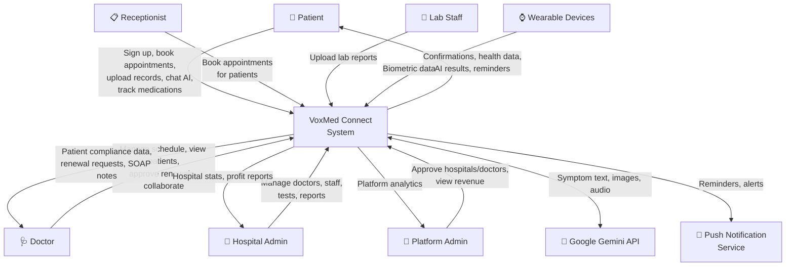

---

### 13.2 DFD Level 1

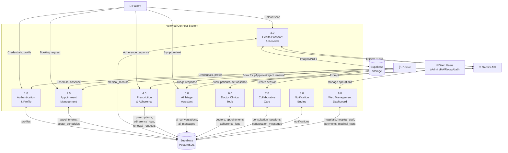

---

### 13.3 DFD Level 2 — Appointment Management (Process 2.0)

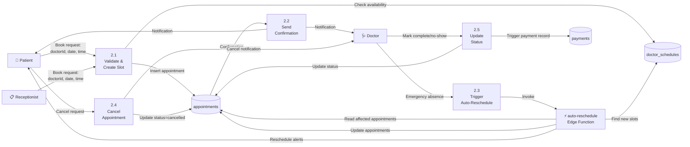

---

### 13.4 DFD Level 2 — AI Triage Subsystem (Process 5.0)

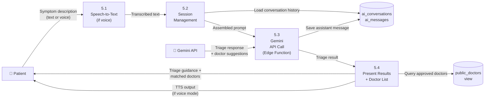

---

### 13.5 ER Diagram

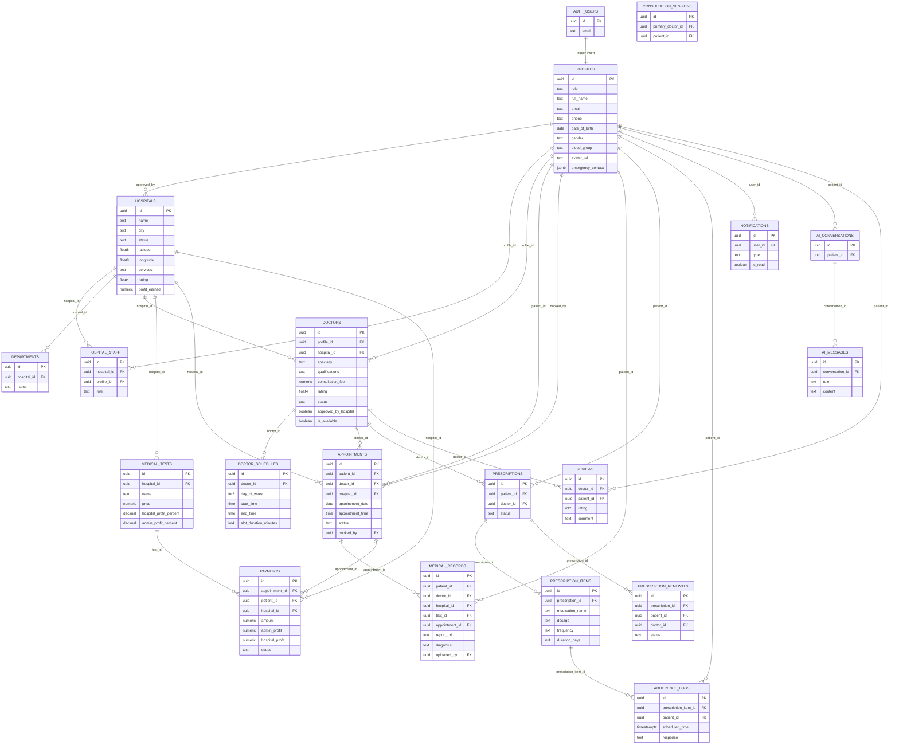

---

### 13.6 Class Diagram

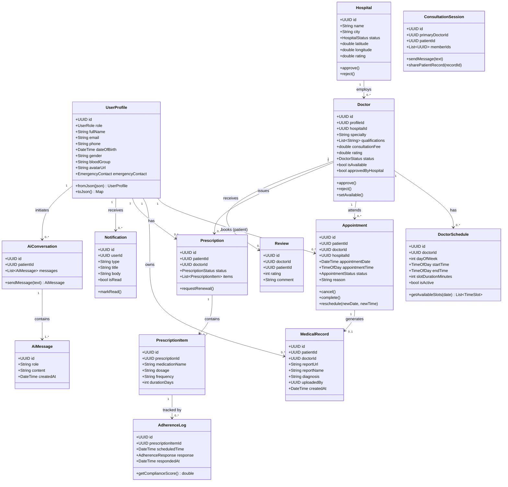

---

### 13.7 Use Case Diagram

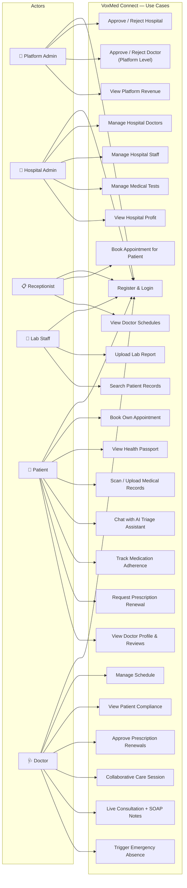

---

### 13.8 Activity Diagram — Patient Books an Appointment

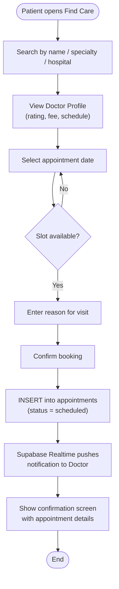

---

### 13.9 Activity Diagram — Doctor Approves Prescription Renewal

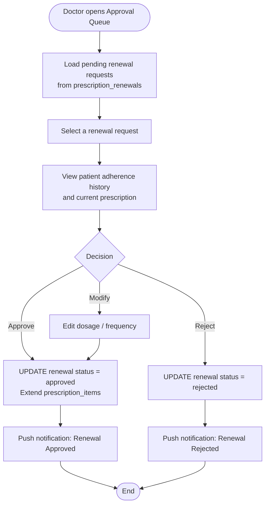

---

### 13.10 Sequence Diagram — Patient Books an Appointment

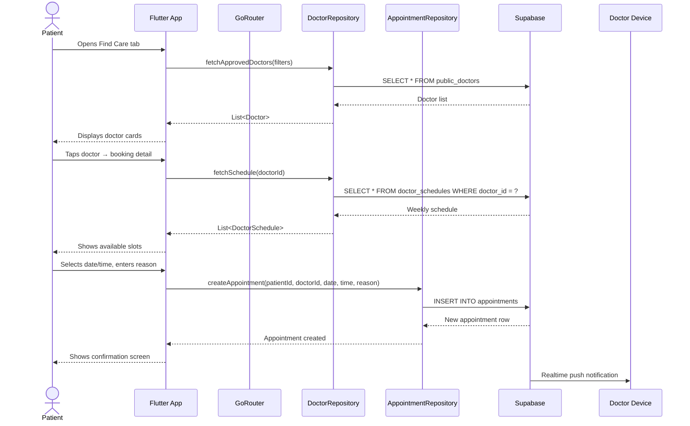

---

### 13.11 Sequence Diagram — OCR Record Upload

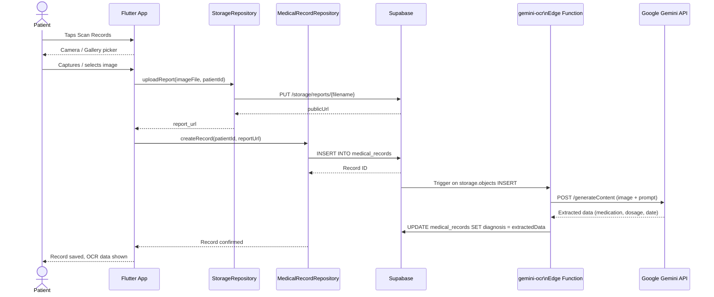

---

### 13.12 Workflow Diagram (System-wide)

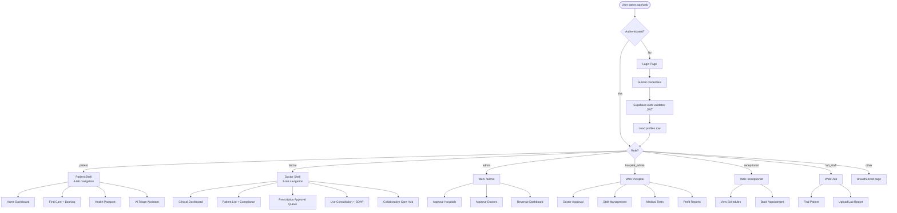

---

## 14. Development Phases & Status

| Phase | Description | Status |
|---|---|---|
| 0 | Project setup, design mockups, UI stubs, GoRouter, widgets | ✅ Complete |
| 1 | Foundation & Auth (Supabase init, models, auth screens, Riverpod) | ✅ Complete |
| 2 | Health Passport & Records (MedicalRecord model, scan upload) | 🔄 In Progress |
| 3 | Find Care & Booking (hospital/doctor search, appointment booking) | ✅ Complete |
| 4 | AI Assistant (chat → voice → agentic workflows) | 🔄 In Progress |
| 5 | Prescription & Adherence (renewal flow, adherence tracking) | ⏳ Planned |
| 6 | Doctor Clinical Tools (dashboard, SOAP notes, absence trigger) | ⏳ Planned |
| 7 | Collaborative Care (multi-doctor sessions, Realtime chat) | ⏳ Planned |
| 8 | Web Dashboard (all roles — hospital admin, receptionist, lab, admin) | ✅ Designed |
| 9 | Notifications, Wearable Integration, Performance Hardening | ⏳ Planned |

---

## 15. Screen Inventory

### Flutter Mobile App Screens

| Screen | File | Role |
|---|---|---|
| Login | `auth/login_screen.dart` | All |
| Register | `auth/register_screen.dart` | All |
| Role Selection | `auth/role_selection_screen.dart` | All |
| Patient Dashboard | `dashboard_screen.dart` | Patient |
| Find Care | `find_care_screen.dart` | Patient |
| Doctor Booking Detail | `doctor_booking_detail_screen.dart` | Patient |
| Health Passport | `health_passport_screen.dart` | Patient |
| Health Analytics | `health_analytics_screen.dart` | Patient |
| Scan Records | `scan_records_screen.dart` | Patient |
| Prescription Renewals | `prescription_renewals_screen.dart` | Patient |
| AI Assistant | `ai_assistant_screen.dart` | Patient |
| Profile | `profile_screen.dart` | Patient / Doctor |
| Clinical Dashboard | `clinical_dashboard_screen.dart` | Doctor |
| My Patients | `my_patients_screen.dart` | Doctor |
| Patient Detail | `patient_detail_screen.dart` | Doctor |
| Doctor Chat | `doctor_chat_screen.dart` | Doctor |
| Doctor Schedule | `doctor_schedule_screen.dart` | Doctor |
| Approval Queue | `approval_queue_screen.dart` | Doctor |
| Collaborative Hub | `collaborative_hub_screen.dart` | Doctor |
| Live Consultation | `live_consultation_screen.dart` | Doctor |

### Web Dashboard (HTML Design Prototypes)

| HTML File | Page | Role |
|---|---|---|
| `dashboard.html` | Platform Admin Dashboard | Admin |
| `approval_queue.html` | Approval Queue | Admin / Hospital Admin |
| `clinical_dashboard.html` | Clinical Dashboard | Doctor / Hospital Admin |
| `collaborative_hub.html` | Collaborative Hub | Doctor |
| `ai_assistant.html` | AI Assistant | Patient |
| `find_care_1.html` | Find Care — Hospital List | Patient |
| `find_care_2.html` | Find Care — Doctor List | Patient |
| `doctor_booking_detail.html` | Doctor Booking Detail | Patient |
| `health_analytics.html` | Health Analytics | Patient |
| `health_passport.html` | Health Passport | Patient |
| `live_consultation.html` | Live Consultation | Doctor |

---

*VoxMed Connect — Dual-Platform Healthcare Ecosystem | Flutter + React + Supabase + Google Gemini*
