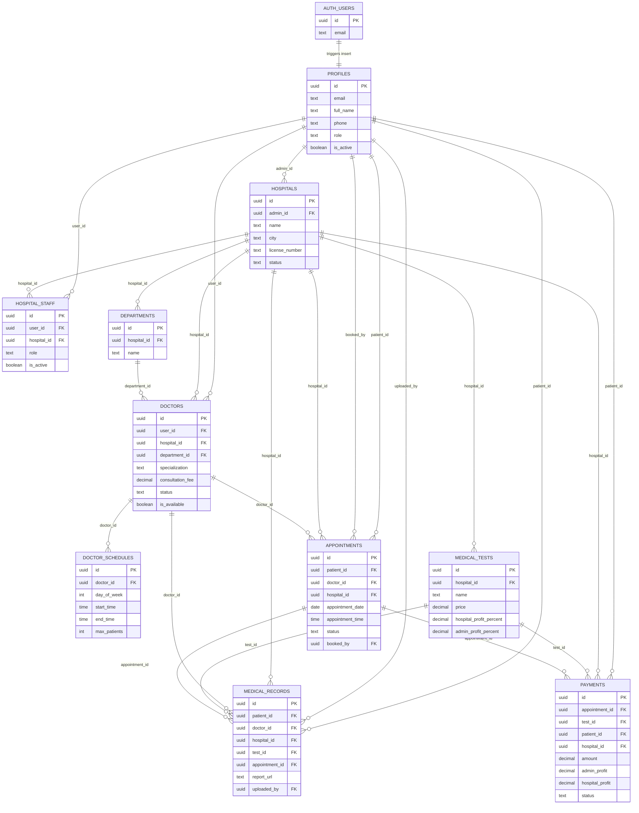
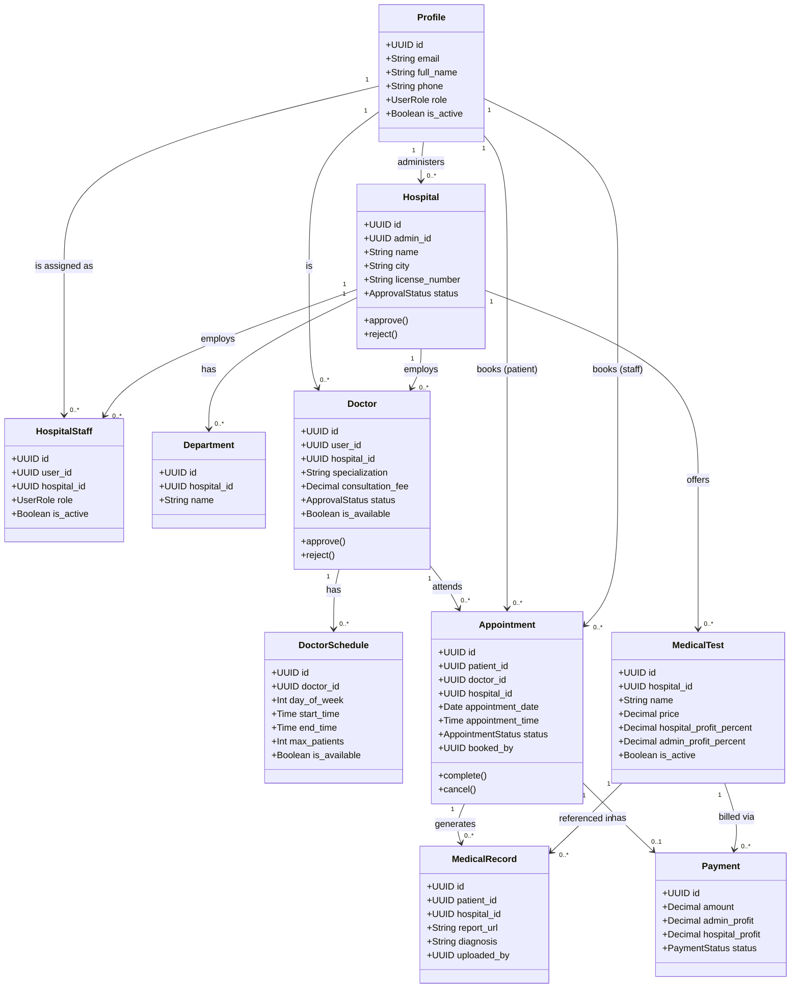
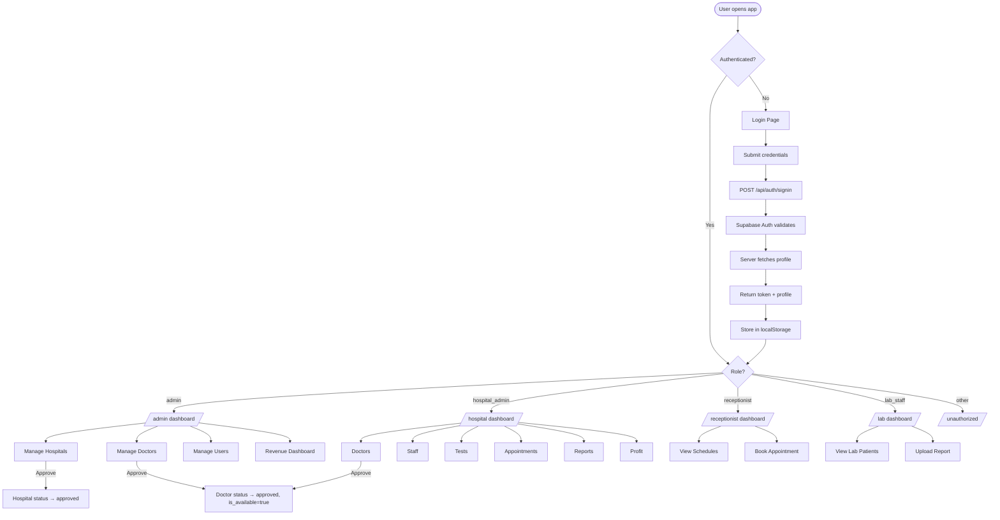
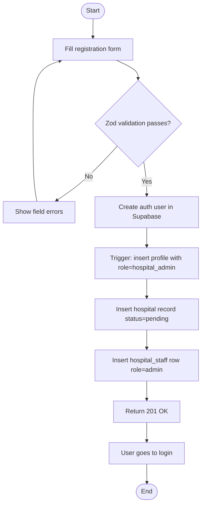
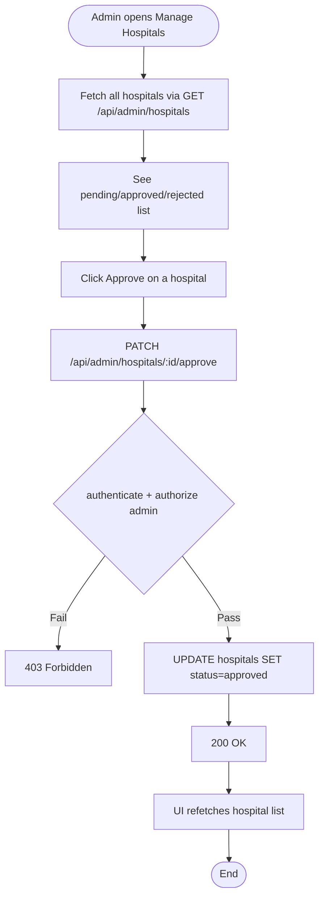
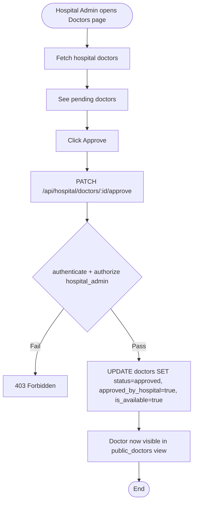
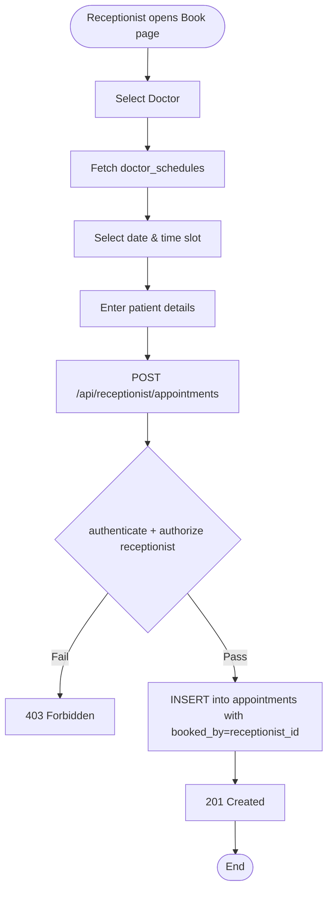
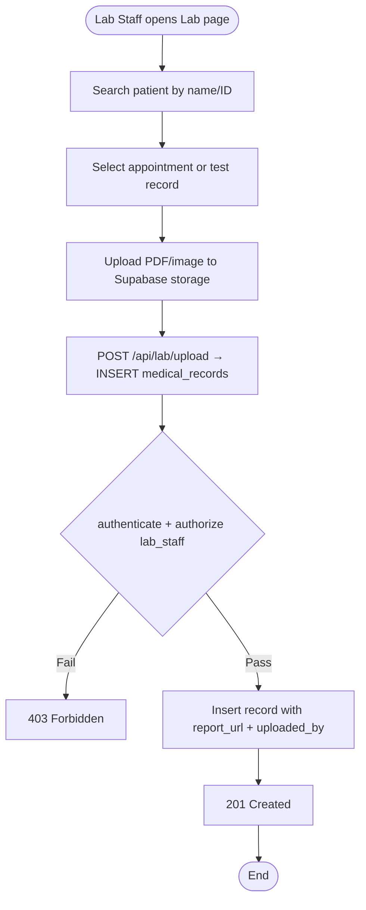

# VoxMed Connect — Complete Project Documentation

## Table of Contents

1. [Project Overview](#1-project-overview)
2. [Tech Stack](#2-tech-stack)
3. [System Architecture](#3-system-architecture)
4. [Roles & Access Control](#4-roles--access-control)
5. [Database Schema](#5-database-schema)
6. [ER Diagram](#6-er-diagram)
7. [Class Diagram](#7-class-diagram)
8. [Workflow Diagram](#8-workflow-diagram)
9. [Activity Diagrams](#9-activity-diagrams)
10. [API Endpoints](#10-api-endpoints)
11. [Frontend Route Map](#11-frontend-route-map)
12. [Security Model](#12-security-model)

---

## 1. Project Overview

**VoxMed Connect** is a role-based healthcare management web platform. It centralises hospital operations — doctor management, appointment booking, lab uploads, and revenue tracking — behind a single dashboard interface.

### What the system does

| Area | Description |
|---|---|
| **Platform Admin** | Approves hospitals and doctors, manages all users, views platform-wide revenue |
| **Hospital Admin** | Manages their hospital's doctors, staff, medical tests, appointments, reports, and profit |
| **Receptionist** | Views doctor schedules and books appointments on behalf of patients |
| **Lab Staff** | Looks up patient records and uploads test result reports |

---

## 2. Tech Stack

| Layer | Technology |
|---|---|
| Frontend | React 18, Vite, React Router v6, Tailwind CSS |
| Backend | Node.js, Express, Zod (validation) |
| Database | Supabase PostgreSQL |
| Auth | Supabase Auth (JWT) |
| Security | Helmet, CORS whitelist, express-rate-limit |
| Deployment | Vercel (client + server via `vercel.json`) |

---

## 3. System Architecture

```
┌────────────────────────────────────┐
│          React Client              │
│   (Vite, React Router, Tailwind)   │
│                                    │
│  AuthContext ──► ProtectedRoute    │
│  ThemeContext   DashboardLayout    │
└──────────────────┬─────────────────┘
                   │ HTTP (JWT Bearer)
                   ▼
┌────────────────────────────────────┐
│         Express API Server         │
│                                    │
│  Middleware: Helmet, CORS,         │
│  Rate Limit, authenticate(),       │
│  authorize(), attachHospital()     │
│                                    │
│  Routes: /api/auth                 │
│           /api/admin/*             │
│           /api/hospital/*          │
│           /api/receptionist        │
│           /api/lab                 │
│           /api/reports             │
└──────────────────┬─────────────────┘
                   │ Supabase Admin SDK
                   ▼
┌────────────────────────────────────┐
│         Supabase (PostgreSQL)      │
│                                    │
│  auth.users ──► profiles           │
│  hospitals, doctors, hospital_staff│
│  departments, doctor_schedules     │
│  appointments, medical_tests       │
│  medical_records, payments         │
│  VIEW: public_doctors              │
└────────────────────────────────────┘
```

---

## 4. Roles & Access Control

### Roles (enum: `user_role`)

| Role | Description | Dashboard Path |
|---|---|---|
| `admin` | Platform superadmin | `/admin` |
| `hospital_admin` | Manages one hospital | `/hospital` |
| `receptionist` | Books appointments | `/receptionist` |
| `lab_staff` | Uploads lab reports | `/lab` |
| `doctor` | Doctor (auth only, no dashboard yet) | — |
| `patient` | Patient (auth only, no dashboard yet) | — |

### Middleware chain (every protected API call)

```
Request → authenticate() → authorize(role) → attachHospital() → Route handler
```

- **`authenticate()`** — Verifies the Bearer JWT via Supabase, loads the `profiles` row, attaches `req.user`.
- **`authorize(...roles)`** — Checks `req.user.profile.role` against allowed roles; returns 403 if not matched.
- **`attachHospital()`** — For `hospital_admin`, `receptionist`, `lab_staff`: resolves `hospital_id` from `hospital_staff` and sets `req.hospitalId`.

---

## 5. Database Schema

### Enum Types

```sql
user_role       :: admin | hospital_admin | receptionist | lab_staff | doctor | patient
approval_status :: pending | approved | rejected
appointment_status :: scheduled | completed | cancelled | no_show
payment_status  :: pending | paid | refunded
```

### Tables

#### `profiles` (extends `auth.users`)

| Column | Type | Notes |
|---|---|---|
| id | UUID PK | References `auth.users(id)` |
| email | TEXT | Unique user email |
| full_name | TEXT | Display name |
| phone | TEXT | Optional |
| avatar_url | TEXT | Optional |
| role | user_role | Default: `patient` |
| is_active | BOOLEAN | Default: true |
| created_at / updated_at | TIMESTAMPTZ | Auto-managed |

---

#### `hospitals`

| Column | Type | Notes |
|---|---|---|
| id | UUID PK | |
| admin_id | UUID FK → profiles | Hospital owner |
| name | TEXT | |
| address / city / state | TEXT | |
| phone / email | TEXT | |
| license_number | TEXT UNIQUE | |
| license_document_url | TEXT | |
| logo_url | TEXT | |
| description | TEXT | |
| status | approval_status | Default: `pending` |
| created_at / updated_at | TIMESTAMPTZ | |

---

#### `hospital_staff`

| Column | Type | Notes |
|---|---|---|
| id | UUID PK | |
| user_id | UUID FK → profiles | |
| hospital_id | UUID FK → hospitals | |
| role | user_role | `receptionist` or `lab_staff` |
| is_active | BOOLEAN | |
| created_at | TIMESTAMPTZ | |

Unique constraint: `(user_id, hospital_id)`

---

#### `departments`

| Column | Type | Notes |
|---|---|---|
| id | UUID PK | |
| hospital_id | UUID FK → hospitals | |
| name | TEXT | |
| description | TEXT | |
| created_at | TIMESTAMPTZ | |

---

#### `doctors`

| Column | Type | Notes |
|---|---|---|
| id | UUID PK | |
| user_id | UUID FK → profiles | |
| hospital_id | UUID FK → hospitals | Nullable (SET NULL on delete) |
| department_id | UUID FK → departments | Nullable |
| specialization | TEXT | |
| qualification | TEXT | |
| experience_years | INTEGER | Default: 0 |
| license_number | TEXT UNIQUE | |
| license_document_url | TEXT | |
| room_number | TEXT | |
| consultation_fee | DECIMAL(10,2) | In ৳ |
| status | approval_status | Default: `pending` |
| is_available | BOOLEAN | Set to true on approval |
| bio | TEXT | |
| created_at / updated_at | TIMESTAMPTZ | |

---

#### `doctor_schedules`

| Column | Type | Notes |
|---|---|---|
| id | UUID PK | |
| doctor_id | UUID FK → doctors | |
| day_of_week | INTEGER (0–6) | 0=Sunday |
| start_time / end_time | TIME | |
| max_patients | INTEGER | Default: 20 |
| is_available | BOOLEAN | |
| created_at | TIMESTAMPTZ | |

Unique constraint: `(doctor_id, day_of_week)`

---

#### `medical_tests`

| Column | Type | Notes |
|---|---|---|
| id | UUID PK | |
| hospital_id | UUID FK → hospitals | |
| name | TEXT | |
| description / category | TEXT | |
| price | DECIMAL(10,2) | In ৳ |
| hospital_profit_percent | DECIMAL(5,2) | Default: 90% |
| admin_profit_percent | DECIMAL(5,2) | Default: 10% |
| is_active | BOOLEAN | |
| created_at / updated_at | TIMESTAMPTZ | |

---

#### `appointments`

| Column | Type | Notes |
|---|---|---|
| id | UUID PK | |
| patient_id | UUID FK → profiles | |
| doctor_id | UUID FK → doctors | |
| hospital_id | UUID FK → hospitals | |
| appointment_date | DATE | |
| appointment_time | TIME | |
| status | appointment_status | Default: `scheduled` |
| reason / notes | TEXT | |
| booked_by | UUID FK → profiles | Staff who booked |
| created_at / updated_at | TIMESTAMPTZ | |

---

#### `medical_records`

| Column | Type | Notes |
|---|---|---|
| id | UUID PK | |
| patient_id | UUID FK → profiles | |
| doctor_id | UUID FK → doctors | Nullable |
| hospital_id | UUID FK → hospitals | |
| test_id | UUID FK → medical_tests | Nullable |
| appointment_id | UUID FK → appointments | Nullable |
| report_url | TEXT | Supabase storage URL |
| report_name | TEXT | |
| diagnosis / notes | TEXT | |
| uploaded_by | UUID FK → profiles | |
| created_at / updated_at | TIMESTAMPTZ | |

---

#### `payments`

| Column | Type | Notes |
|---|---|---|
| id | UUID PK | |
| appointment_id | UUID FK → appointments | Nullable |
| test_id | UUID FK → medical_tests | Nullable |
| patient_id | UUID FK → profiles | |
| hospital_id | UUID FK → hospitals | |
| amount | DECIMAL(10,2) | |
| admin_profit | DECIMAL(10,2) | |
| hospital_profit | DECIMAL(10,2) | |
| status | payment_status | Default: `pending` |
| payment_method | TEXT | |
| created_at | TIMESTAMPTZ | |

---

### View: `public_doctors`

Read-only view for patient-facing apps. Only exposes doctors that are fully approved and available.

```sql
SELECT ... FROM doctors d
WHERE  d.status = 'approved'
  AND  d.approved_by_hospital = true
  AND  d.is_available = true;
```

`GRANT SELECT ON public_doctors TO anon, authenticated;`

---

### Triggers & Functions

| Trigger | Table | Action |
|---|---|---|
| `profiles_updated_at` | profiles | Sets `updated_at = NOW()` on every UPDATE |
| `hospitals_updated_at` | hospitals | Same |
| `doctors_updated_at` | doctors | Same |
| `medical_tests_updated_at` | medical_tests | Same |
| `appointments_updated_at` | appointments | Same |
| `medical_records_updated_at` | medical_records | Same |
| `on_auth_user_created` | auth.users | Inserts row into `profiles` after new user signup |

---

### Row Level Security (RLS)

| Table | Policy summary |
|---|---|
| profiles | Own row read/write; service_role full access |
| hospitals | Public read if `status='approved'`; admin owns their row; service_role full |
| doctors | Public read if `status='approved'`; service_role full |
| appointments | Patient reads own rows; service_role full |
| medical_records | Patient reads own rows; service_role full |
| All others | service_role full access only |

---

## 6. ER Diagram



---

## 7. Class Diagram



---

## 8. Workflow Diagram



---

## 9. Activity Diagrams

### 9.1 Hospital Admin Registration



---

### 9.2 Admin Approves a Hospital



---

### 9.3 Hospital Admin Approves a Doctor



---

### 9.4 Receptionist Books an Appointment



---

### 9.5 Lab Staff Uploads a Report



---

## 10. API Endpoints

### Auth — `/api/auth`

| Method | Path | Access | Description |
|---|---|---|---|
| GET | `/hospitals` | Public | List approved hospitals (for doctor signup form) |
| POST | `/signup` | Public | Register hospital admin + create hospital |
| POST | `/signin` | Public | Sign in, returns JWT + profile |
| POST | `/doctor-signup` | Public | Register a doctor under a hospital |
| POST | `/refresh` | Public | Refresh JWT token |
| GET | `/me` | Authenticated | Get current user profile |

### Admin — `/api/admin`

| Method | Path | Access | Description |
|---|---|---|---|
| GET | `/hospitals` | admin | List all hospitals |
| PATCH | `/hospitals/:id/approve` | admin | Approve a hospital |
| PATCH | `/hospitals/:id/reject` | admin | Reject a hospital |
| GET | `/doctors` | admin | List all doctors |
| PATCH | `/doctors/:id/approve` | admin | Approve a doctor |
| PATCH | `/doctors/:id/reject` | admin | Reject a doctor |
| GET | `/users` | admin | List all users |
| GET | `/revenue` | admin | Platform revenue summary |

### Hospital — `/api/hospital`

| Method | Path | Access | Description |
|---|---|---|---|
| GET | `/dashboard` | hospital_admin | Stats summary for the hospital |
| GET | `/doctors` | hospital_admin | List hospital's doctors |
| PATCH | `/doctors/:id/approve` | hospital_admin | Approve doctor + set is_available=true |
| PATCH | `/doctors/:id/reject` | hospital_admin | Reject a doctor |
| GET | `/staff` | hospital_admin | List hospital staff |
| POST | `/staff` | hospital_admin | Add staff member |
| DELETE | `/staff/:id` | hospital_admin | Remove staff member |
| GET | `/tests` | hospital_admin | List medical tests |
| POST | `/tests` | hospital_admin | Create a medical test |
| PUT | `/tests/:id` | hospital_admin | Update a medical test |
| DELETE | `/tests/:id` | hospital_admin | Delete a medical test |
| GET | `/appointments` | hospital_admin | List appointments |
| GET | `/reports` | hospital_admin | List medical records |
| GET | `/profit` | hospital_admin | Profit breakdown |

### Receptionist — `/api/receptionist`

| Method | Path | Access | Description |
|---|---|---|---|
| GET | `/schedules` | receptionist | View doctor schedules |
| GET | `/doctors` | receptionist | List available doctors |
| POST | `/appointments` | receptionist | Book an appointment |

### Lab — `/api/lab`

| Method | Path | Access | Description |
|---|---|---|---|
| GET | `/patients` | lab_staff | List patients with records |
| POST | `/upload` | lab_staff | Upload a medical report |

### Reports — `/api/reports`

| Method | Path | Access | Description |
|---|---|---|---|
| GET | `/` | hospital_admin, lab_staff | Get medical records |

---

## 11. Frontend Route Map

```
/login                        → LoginPage (public)
/register                     → RegisterPage (public)
/unauthorized                 → Unauthorized (public)

/admin                        → AdminDashboard         [role: admin]
/admin/hospitals              → ManageHospitals         [role: admin]
/admin/doctors                → ManageDoctors           [role: admin]
/admin/users                  → ManageUsers             [role: admin]
/admin/revenue                → RevenueDashboard        [role: admin]

/hospital                     → HospitalDashboard       [role: hospital_admin]
/hospital/doctors             → HospitalDoctors         [role: hospital_admin]
/hospital/staff               → HospitalStaff           [role: hospital_admin]
/hospital/tests               → HospitalTests           [role: hospital_admin]
/hospital/appointments        → HospitalAppointments    [role: hospital_admin]
/hospital/reports             → HospitalReports         [role: hospital_admin]
/hospital/profit              → HospitalProfit          [role: hospital_admin]

/receptionist                 → ReceptionistSchedules   [role: receptionist]
/receptionist/book            → ReceptionistBook        [role: receptionist]

/lab                          → LabPatients             [role: lab_staff]
/lab/upload                   → LabUpload               [role: lab_staff]

/                             → redirect → /login
*                             → redirect → /login
```

All role-protected routes pass through `ProtectedRoute`, which:
1. Shows a loading state while auth is resolving.
2. Redirects to `/login?redirect=<path>` if unauthenticated.
3. Redirects to `/unauthorized` if authenticated but wrong role.
4. Renders `DashboardLayout` + nested page if authorized.

---

## 12. Security Model

| Concern | Implementation |
|---|---|
| **Transport** | CORS whitelist (localhost + Vercel domain only) |
| **Headers** | `helmet()` sets security headers (CSP, HSTS, etc.) |
| **Rate limiting** | 100 requests / 15 min per IP on `/api/` |
| **Authentication** | Supabase JWT verified server-side on every protected request |
| **Authorisation** | Role checked via `authorize()` middleware before any DB operation |
| **Hospital scoping** | `attachHospital()` resolves `hospital_id` from `hospital_staff` — staff cannot access other hospitals' data |
| **Database RLS** | Row-level security on all tables; service_role key used server-side only (never exposed to client) |
| **Input validation** | Zod schemas validate all request bodies before processing |
| **Storage** | Files uploaded to Supabase Storage buckets (`licenses`, `reports`, `avatars`) |
| **Currency** | All monetary values in Bangladeshi Taka (৳), formatted via `formatCurrency()` |
